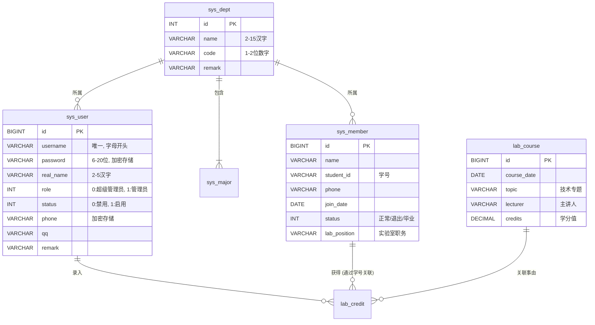

# 我的笔记

这是一个整理计算机组成原理知识的笔记集合。

## 目录

- **计算机组成原理**：包含整理后的知识点和相关笔记。

## 使用说明

- 浏览 `计算机组成原理` 文件夹以查看详细笔记。
- `计算机组成原理/知识整理.md` 文件提供了知识体系的概览和索引。

```mermaid

erDiagram

    sys_user ||--o{ lab_credit : "录入"

    sys_dept ||--|{ sys_major : "包含"

    sys_dept ||--o{ sys_member : "所属"

    sys_dept ||--o{ sys_user : "所属"

    sys_member ||--o{ lab_credit : "获得 (通过学号关联)"

    lab_course ||--o{ lab_credit : "关联事由"

    sys_user {

        BIGINT id PK

        VARCHAR username "唯一, 字母开头"

        VARCHAR password "6-20位, 加密存储"

        VARCHAR real_name "2-5汉字"

        INT role "0:超级管理员, 1:管理员"

        INT status "0:禁用, 1:启用"

        VARCHAR phone "加密存储"

        VARCHAR qq

        VARCHAR remark

    }

    sys_dept {

        INT id PK

        VARCHAR name "2-15汉字"

        VARCHAR code "1-2位数字"

        VARCHAR remark

    }

    sys_member {

        BIGINT id PK

        VARCHAR name

        VARCHAR student_id "学号"

        VARCHAR phone

        DATE join_date

        INT status "正常/退出/毕业"

        VARCHAR lab_position "实验室职务"

    }

    lab_course {

        BIGINT id PK

        DATE course_date

        VARCHAR topic "技术专题"

        VARCHAR lecturer "主讲人"

        DECIMAL credits "学分值"

    }

```