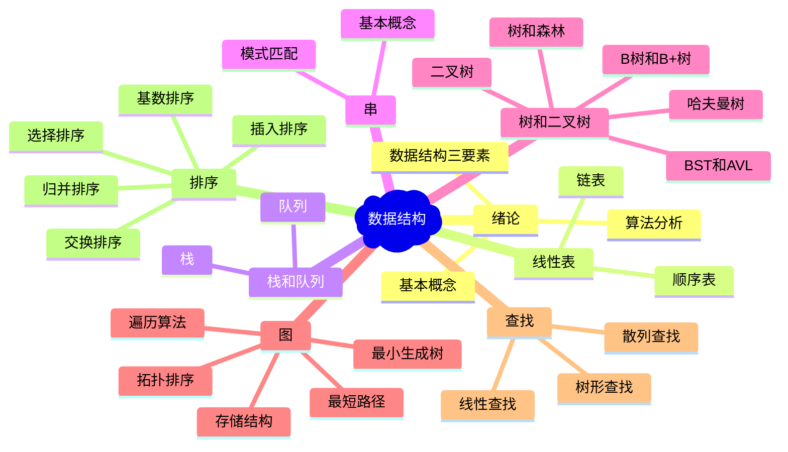

# 数据结构思维导图

> 统一的数据结构知识体系可视化思维导图  
> 使用 Mermaid 语法创建，完全支持 Obsidian、Typora、GitHub 等编辑器

---

## 📊 总体架构思维导图

> **提示：** 提供了两种可视化方案，如果 mindmap 无法显示，请查看 flowchart 版本

### 方案一：Mermaid Mindmap（简化版）



### 方案二：Mermaid Flowchart（层级结构图）

```mermaid
flowchart TD
    A[数据结构] --> B[绪论]
    A --> C[线性表]
    A --> D[栈和队列]
    A --> E[串]
    A --> F[树和二叉树]
    A --> G[图]
    A --> H[查找]
    A --> I[排序]
    
    B --> B1[基本概念]
    B --> B2[数据结构三要素]
    B --> B3[算法分析]
    
    C --> C1[顺序表]
    C --> C2[链表]
    C1 --> C11[基本操作]
    C1 --> C12[时间复杂度]
    C2 --> C21[单链表]
    C2 --> C22[双链表]
    C2 --> C23[循环链表]
    
    D --> D1[栈]
    D --> D2[队列]
    D1 --> D11[顺序栈]
    D1 --> D12[链栈]
    D1 --> D13[应用]
    D2 --> D21[循环队列]
    D2 --> D22[链队列]
    
    E --> E1[基本概念]
    E --> E2[存储结构]
    E --> E3[模式匹配]
    E3 --> E31[朴素算法]
    E3 --> E32[KMP算法]
    E3 --> E33[BM算法]
    
    F --> F1[二叉树]
    F --> F2[树和森林]
    F --> F3[哈夫曼树]
    F --> F4[BST和AVL]
    F --> F5[B树和B+树]
    F1 --> F11[遍历]
    F1 --> F12[线索二叉树]
    F4 --> F41[二叉排序树]
    F4 --> F42[平衡二叉树]
    
    G --> G1[存储结构]
    G --> G2[遍历]
    G --> G3[最小生成树]
    G --> G4[最短路径]
    G --> G5[拓扑排序]
    G1 --> G11[邻接矩阵]
    G1 --> G12[邻接表]
    G2 --> G21[DFS]
    G2 --> G22[BFS]
    G3 --> G31[Prim算法]
    G3 --> G32[Kruskal算法]
    G4 --> G41[Dijkstra]
    G4 --> G42[Floyd]
    
    H --> H1[线性查找]
    H --> H2[树形查找]
    H --> H3[散列查找]
    H1 --> H11[顺序查找]
    H1 --> H12[折半查找]
    H2 --> H21[BST]
    H2 --> H22[AVL]
    H2 --> H23[B树]
    H3 --> H31[散列函数]
    H3 --> H32[冲突处理]
    
    I --> I1[插入排序]
    I --> I2[交换排序]
    I --> I3[选择排序]
    I --> I4[归并排序]
    I --> I5[基数排序]
    I1 --> I11[直接插入]
    I1 --> I12[希尔排序]
    I2 --> I21[冒泡排序]
    I2 --> I22[快速排序]
    I3 --> I31[简单选择]
    I3 --> I32[堆排序]
    
    style A fill:#ff6b6b,stroke:#333,stroke-width:3px,color:#fff
    style B fill:#4ecdc4,stroke:#333,stroke-width:2px
    style C fill:#45b7d1,stroke:#333,stroke-width:2px
    style D fill:#96ceb4,stroke:#333,stroke-width:2px
    style E fill:#ffeaa7,stroke:#333,stroke-width:2px
    style F fill:#dda15e,stroke:#333,stroke-width:2px
    style G fill:#a29bfe,stroke:#333,stroke-width:2px
    style H fill:#fd79a8,stroke:#333,stroke-width:2px
    style I fill:#fdcb6e,stroke:#333,stroke-width:2px
```



---

## 📊 备用思维导图（文本格式）

如果上面的 Mermaid 图表无法显示，可以使用下面的文本格式查看结构：

```
数据结构
├── 绪论
│   ├── 基本概念
│   ├── 数据结构三要素
│   └── 算法分析
├── 线性表
│   ├── 顺序表
│   └── 链表
├── 栈和队列
│   ├── 栈
│   └── 队列
├── 串
│   ├── 基本概念
│   └── 模式匹配
├── 树和二叉树
│   ├── 二叉树
│   ├── 树和森林
│   ├── 哈夫曼树
│   ├── BST和AVL
│   └── B树和B+树
├── 图
│   ├── 存储结构
│   ├── 遍历算法
│   ├── 最小生成树
│   ├── 最短路径
│   └── 拓扑排序
├── 查找
│   ├── 线性查找
│   ├── 树形查找
│   └── 散列查找
└── 排序
    ├── 插入排序
    ├── 交换排序
    ├── 选择排序
    ├── 归并排序
    └── 基数排序
```

---

如果上面的 Mermaid mindmap 无法显示，可以使用下面的文本格式：

```
数据结构
├── 绪论
│   ├── 基本概念
│   │   ├── 数据
│   │   ├── 数据元素
│   │   ├── 数据项
│   │   ├── 数据对象
│   │   └── 数据结构
│   ├── 数据结构三要素
│   │   ├── 逻辑结构
│   │   │   ├── 线性结构
│   │   │   ├── 非线性结构
│   │   │   │   ├── 树形结构
│   │   │   │   └── 图状结构
│   │   │   └── 集合结构
│   │   ├── 存储结构
│   │   │   ├── 顺序存储
│   │   │   ├── 链式存储
│   │   │   ├── 索引存储
│   │   │   └── 散列存储
│   │   └── 数据运算
│   │       ├── 插入
│   │       ├── 删除
│   │       ├── 查找
│   │       ├── 修改
│   │       └── 排序
│   └── 算法分析
│       ├── 时间复杂度
│       │   ├── 最好情况
│       │   ├── 平均情况
│       │   ├── 最坏情况
│       │   └── 大O表示法
│       ├── 空间复杂度
│       │   ├── 辅助空间
│       │   └── 递归空间
│       └── 算法特性
│           ├── 有穷性
│           ├── 确定性
│           ├── 可行性
│           ├── 输入
│           └── 输出
├── 线性表
│   ├── 顺序表
│   │   ├── 基本概念
│   │   │   ├── 连续存储
│   │   │   ├── 随机存取
│   │   │   └── 存储密度高
│   │   ├── 基本操作
│   │   │   ├── 初始化
│   │   │   ├── 插入
│   │   │   ├── 删除
│   │   │   ├── 查找
│   │   │   └── 遍历
│   │   ├── 时间复杂度
│   │   │   ├── 插入O(n)
│   │   │   ├── 删除O(n)
│   │   │   ├── 查找O(n)
│   │   │   └── 访问O(1)
│   │   ├── 空间复杂度: O(n)
│   │   └── 优缺点
│   │       ├── 优点: 随机存取、存储密度高
│   │       └── 缺点: 插入删除慢、需要预分配空间
│   └── 链表
│       ├── 单链表
│       │   ├── 基本概念: 节点结构、头指针、头节点
│       │   ├── 基本操作: 创建、插入、删除、查找、遍历
│       │   ├── 时间复杂度: 插入O(1)或O(n)、删除O(1)或O(n)、查找O(n)、访问O(n)
│       │   └── 空间复杂度: O(n)
│       ├── 双链表
│       │   ├── 基本概念: 前驱指针、后继指针
│       │   ├── 基本操作: 插入、删除、遍历
│       │   └── 优缺点: 双向遍历、删除效率高，但空间开销大
│       ├── 循环链表: 单循环链表、双循环链表、应用
│       ├── 静态链表: 数组实现、游标实现、应用场景
│       └── 链表应用: 多项式相加、大整数运算、邻接表
├── 栈和队列
│   ├── 栈
│   │   ├── 基本概念: 后进先出LIFO、栈顶、栈底
│   │   ├── 顺序栈: 基本操作、时间复杂度O(1)、空间复杂度O(n)
│   │   ├── 链栈: 基本操作、优缺点
│   │   └── 栈的应用: 括号匹配、表达式求值、递归实现、进制转换、迷宫求解
│   └── 队列
│       ├── 基本概念: 先进先出FIFO、队头、队尾
│       ├── 顺序队列: 基本操作、循环队列
│       ├── 链队列: 基本操作、优缺点
│       ├── 双端队列: 输入受限、输出受限、双端受限
│       └── 队列应用: 层次遍历、缓冲区、消息队列、广度优先搜索
├── 串
│   ├── 基本概念: 字符串、子串、主串、字符位置、子串位置
│   ├── 存储结构: 顺序存储、链式存储
│   ├── 基本操作: 赋值、比较、连接、求子串、定位、替换、插入、删除
│   ├── 模式匹配
│   │   ├── 朴素算法: 时间复杂度O(mn)、空间复杂度O(1)
│   │   ├── KMP算法: next数组、nextval数组、时间复杂度O(m+n)
│   │   └── BM算法: 坏字符规则、好后缀规则
│   └── 串的应用: 文本编辑器、搜索引擎、数据压缩
├── 树和二叉树
│   ├── 树的基本概念: 定义、术语、树的遍历
│   ├── 二叉树
│   │   ├── 基本概念: 定义、五种基本形态、特殊二叉树
│   │   ├── 性质: 节点数、叶子节点数、度为2节点数、深度关系
│   │   ├── 存储结构: 顺序存储、链式存储
│   │   ├── 遍历: 先序、中序、后序、层次遍历
│   │   └── 线索二叉树: 基本概念、中序线索化、遍历线索二叉树
│   ├── 树和森林: 树的存储、树与二叉树转换、森林与二叉树转换、树的遍历、森林的遍历
│   ├── 哈夫曼树: 基本概念、构造算法、哈夫曼编码
│   ├── 二叉排序树BST: 基本概念、基本操作、性能分析
│   ├── 平衡二叉树AVL: 基本概念、旋转操作、插入操作、删除操作、性能分析
│   ├── 红黑树: 基本概念、操作、应用
│   ├── B树和B+树: B树、B+树、基本操作、应用
│   └── 并查集: 基本概念、应用
├── 图
│   ├── 基本概念: 定义、术语
│   ├── 存储结构: 邻接矩阵、邻接表、十字链表、邻接多重表
│   ├── 遍历: 深度优先搜索DFS、广度优先搜索BFS
│   ├── 最小生成树: 基本概念、Prim算法、Kruskal算法
│   ├── 最短路径: 单源最短路径(Dijkstra、Bellman-Ford)、所有顶点对最短路径(Floyd)
│   ├── 拓扑排序: 基本概念、算法实现、应用
│   └── 关键路径: 基本概念、算法实现、应用
├── 查找
│   ├── 基本概念: 查找表、关键字、静态查找、动态查找
│   ├── 线性表查找: 顺序查找、折半查找、分块查找
│   ├── 树形查找: 二叉排序树BST、AVL树、B树、B+树
│   └── 散列查找: 基本概念、散列函数构造、冲突处理方法、性能分析、应用
└── 排序
    ├── 基本概念: 排序定义、稳定性、内部排序、外部排序、排序算法分类
    ├── 插入排序: 直接插入排序、折半插入排序、希尔排序
    ├── 交换排序: 冒泡排序、快速排序
    ├── 选择排序: 简单选择排序、堆排序
    ├── 归并排序: 基本思想、时间复杂度、空间复杂度、稳定性、适用场景
    ├── 基数排序: 基本思想、时间复杂度、空间复杂度、稳定性、适用场景
    ├── 外部排序: 基本概念、算法
    └── 排序算法比较: 时间复杂度、空间复杂度、稳定性、适用场景、性能对比表
```

---

## 📋 数据结构知识体系

### 一、绪论 ⭐⭐⭐

**核心内容：**
- 数据结构基本概念
- 逻辑结构与存储结构
- 算法时间复杂度与空间复杂度分析

**重点：**
- 时间复杂度分析（大O表示法）
- 空间复杂度分析
- 算法特性

---

### 二、线性表 ⭐⭐⭐

**核心内容：**
- 顺序表：连续存储、随机存取
- 链表：单链表、双链表、循环链表、静态链表

**重点：**
- 顺序表与链表的对比
- 基本操作的时间复杂度
- 链表的各种变体及应用

---

### 三、栈和队列 ⭐⭐⭐

**核心内容：**
- 栈：LIFO后进先出
- 队列：FIFO先进先出
- 应用：表达式求值、递归、层次遍历

**重点：**
- 栈的应用（括号匹配、表达式求值）
- 循环队列的实现
- 栈和队列的相互实现

---

### 四、串 ⭐⭐

**核心内容：**
- 串的基本概念和操作
- 模式匹配算法：朴素算法、KMP算法、BM算法

**重点：**
- KMP算法的next数组计算
- nextval数组优化
- 模式匹配的时间复杂度分析

---

### 五、树和二叉树 ⭐⭐⭐

**核心内容：**
- 二叉树的性质和遍历
- 二叉排序树BST
- 平衡二叉树AVL
- 哈夫曼树
- B树和B+树

**重点：**
- 二叉树遍历（先序、中序、后序、层次）
- AVL树的旋转操作
- 哈夫曼编码
- B树和B+树的结构和操作

---

### 六、图 ⭐⭐⭐

**核心内容：**
- 图的存储结构（邻接矩阵、邻接表）
- 图的遍历（DFS、BFS）
- 最小生成树（Prim、Kruskal）
- 最短路径（Dijkstra、Floyd）
- 拓扑排序和关键路径

**重点：**
- 图的遍历算法
- 最小生成树算法对比
- 最短路径算法应用
- 拓扑排序和关键路径算法

---

### 七、查找 ⭐⭐⭐

**核心内容：**
- 线性表查找（顺序查找、折半查找、分块查找）
- 树形查找（BST、AVL、B树、B+树）
- 散列查找（哈希表）

**重点：**
- 折半查找的时间复杂度
- 散列函数的构造方法
- 冲突处理方法（开放定址法、链地址法）
- 散列表的性能分析

---

### 八、排序 ⭐⭐⭐

**核心内容：**
- 插入排序（直接插入、折半插入、希尔）
- 交换排序（冒泡、快速）
- 选择排序（简单选择、堆排序）
- 归并排序
- 基数排序
- 外部排序

**重点：**
- 各种排序算法的时间复杂度
- 排序算法的稳定性
- 快速排序和堆排序的实现
- 排序算法的性能对比

---

## 🎯 学习重点分级

### ⭐⭐⭐ 必考重点
1. **线性表** - 顺序表和链表的所有操作
2. **栈和队列** - 基本操作和应用
3. **树和二叉树** - 遍历、BST、AVL、哈夫曼树
4. **图** - 遍历、最小生成树、最短路径
5. **查找** - 折半查找、散列查找
6. **排序** - 所有排序算法的时间复杂度和稳定性

### ⭐⭐ 重要内容
1. **串** - KMP算法
2. **图** - 拓扑排序、关键路径
3. **查找** - B树、B+树
4. **排序** - 外部排序

### ⭐ 了解内容
1. **绪论** - 基本概念
2. **静态链表** - 应用场景
3. **红黑树** - 高级数据结构
4. **外部排序** - 具体实现细节

---

## 📊 复杂度总结表

### 时间复杂度

| 数据结构/算法 | 最好情况 | 平均情况 | 最坏情况 |
|------------|---------|---------|---------|
| 顺序表查找 | O(1) | O(n) | O(n) |
| 顺序表插入 | O(1) | O(n) | O(n) |
| 顺序表删除 | O(1) | O(n) | O(n) |
| 链表查找 | O(1) | O(n) | O(n) |
| 链表插入 | O(1) | O(1) | O(1) |
| 链表删除 | O(1) | O(1) | O(1) |
| 折半查找 | O(1) | O(log n) | O(log n) |
| 二叉排序树查找 | O(log n) | O(log n) | O(n) |
| AVL树查找 | O(log n) | O(log n) | O(log n) |
| B树查找 | O(log n) | O(log n) | O(log n) |
| 散列表查找 | O(1) | O(1) | O(n) |
| 直接插入排序 | O(n) | O(n²) | O(n²) |
| 希尔排序 | O(n) | O(n^1.3) | O(n²) |
| 冒泡排序 | O(n) | O(n²) | O(n²) |
| 快速排序 | O(n log n) | O(n log n) | O(n²) |
| 简单选择排序 | O(n²) | O(n²) | O(n²) |
| 堆排序 | O(n log n) | O(n log n) | O(n log n) |
| 归并排序 | O(n log n) | O(n log n) | O(n log n) |
| 基数排序 | O(d(n+r)) | O(d(n+r)) | O(d(n+r)) |

### 空间复杂度

| 数据结构/算法 | 空间复杂度 |
|------------|----------|
| 顺序表 | O(n) |
| 链表 | O(n) |
| 栈（顺序） | O(n) |
| 栈（链式） | O(n) |
| 队列（顺序） | O(n) |
| 队列（链式） | O(n) |
| 二叉树 | O(n) |
| 图（邻接矩阵） | O(n²) |
| 图（邻接表） | O(n+e) |
| 快速排序 | O(log n) ~ O(n) |
| 归并排序 | O(n) |
| 基数排序 | O(r) |

---

## 🔗 相关资源

- [代码练习](../代码练习/) - 数据结构代码实现
- [笔记索引](./) - 数据结构笔记索引
- [顺序表精要](./001-顺序表精要.md) - 顺序表详细笔记
- [单链表精要](./002-单链表精要.md) - 单链表详细笔记
- [图精要](./011-图精要.md) - 图的数据结构详细笔记
- [排序精要](./012-排序精要.md) - 排序算法详细笔记
- [查找精要](./013-查找精要.md) - 查找算法详细笔记
- [红黑树精要](./014-红黑树精要.md) - 红黑树详细笔记
- [B树和B+树精要](./015-B树和B+树精要.md) - B树和B+树详细笔记
- [动态规划精要](./016-动态规划精要.md) - 动态规划算法详细笔记
- [字符串匹配精要](./017-字符串匹配精要.md) - 字符串匹配算法（KMP）详细笔记
- [LeetCode](https://leetcode.cn/) - 在线刷题平台
- [王道考研](https://www.cskaoyan.com/) - 考研资料

---

## 📝 使用说明

1. **首次学习**：按照思维导图的层次结构，从绪论开始逐步学习
2. **复习巩固**：使用思维导图快速回顾知识点
3. **代码实践**：结合[代码练习](../代码练习/)目录中的实现加深理解
4. **查漏补缺**：对照思维导图检查知识掌握情况

---

**版本：** v1.0  
**适用：** 数据结构学习、408考研复习  
**特色：** 完整知识体系、清晰层次结构、复杂度总结、学习重点标注

