# 计算机体系结构与组成原理思维导图

> 统一的计算机体系结构与组成原理知识体系可视化思维导图  
> 使用 Mermaid 语法创建，完全支持 Obsidian、Typora、GitHub 等编辑器

---

## 📊 总体架构思维导图

> **Obsidian 提示：** 如果 mindmap 格式无法显示，请查看下方的"备用思维导图（Obsidian兼容版）"

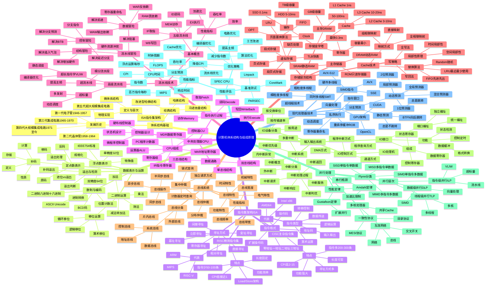

---

## 📋 备用思维导图（Obsidian兼容版）

> 如果上方 mindmap 格式无法显示，可使用此 graph 格式版本

```mermaid
graph TB
    Root[计算机体系结构与组成原理]
    
    Root --> A1[体系结构基础]
    Root --> A2[数据表示与运算]
    Root --> A3[指令集架构ISA]
    Root --> A4[中央处理器CPU]
    Root --> A5[流水线技术]
    Root --> A6[存储层次结构]
    Root --> A7[总线系统]
    Root --> A8[输入输出系统]
    Root --> A9[并行处理]
    Root --> A10[性能评估]
    Root --> A11[现代处理器技术]
    
    A1 --> A1a[定义与层次]
    A1 --> A1b[经典结构]
    A1 --> A1c[发展历史]
    
    A2 --> A2a[数制与编码]
    A2 --> A2b[定点数表示]
    A2 --> A2c[浮点数表示]
    A2 --> A2d[二进制运算]
    A2 --> A2e[溢出与检测]
    
    A2b --> A2b1[原码]
    A2b --> A2b2[反码]
    A2b --> A2b3[补码]
    A2b --> A2b4[移码]
    
    A3 --> A3a[CISC复杂指令集]
    A3 --> A3b[RISC精简指令集]
    A3 --> A3c[指令格式]
    A3 --> A3d[寻址方式]
    A3 --> A3e[指令类型]
    
    A4 --> A4a[CPU组成]
    A4 --> A4b[指令执行过程]
    A4 --> A4c[数据通路]
    A4 --> A4d[控制器设计]
    
    A5 --> A5a[基本概念]
    A5 --> A5b[流水线冒险]
    A5 --> A5c[高级流水线]
    
    A5b --> A5b1[结构冒险]
    A5b --> A5b2[数据冒险]
    A5b --> A5b3[控制冒险]
    
    A6 --> A6a[存储金字塔]
    A6 --> A6b[Cache技术]
    A6 --> A6c[虚拟存储]
    A6 --> A6d[主存储器]
    
    A6b --> A6b1[映射方式]
    A6b --> A6b2[替换算法]
    A6b --> A6b3[写策略]
    
    A7 --> A7a[总线分类]
    A7 --> A7b[总线特性]
    A7 --> A7c[总线仲裁]
    A7 --> A7d[总线操作]
    
    A8 --> A8a[IO设备分类]
    A8 --> A8b[IO接口]
    A8 --> A8c[IO控制方式]
    A8 --> A8d[中断系统]
    
    A9 --> A9a[Flynn分类]
    A9 --> A9b[并行层次]
    A9 --> A9c[多核处理器]
    A9 --> A9d[性能定律]
    
    A10 --> A10a[性能指标]
    A10 --> A10b[基准测试]
    A10 --> A10c[优化策略]
    
    A11 --> A11a[乱序执行]
    A11 --> A11b[分支预测]
    A11 --> A11c[向量处理]
    A11 --> A11d[同时多线程SMT]
    
    style Root fill:#ff6b6b,stroke:#c92a2a,stroke-width:4px,color:#fff
    style A2 fill:#4ecdc4,stroke:#0a9396,stroke-width:2px
    style A5 fill:#96ceb4,stroke:#52b788,stroke-width:2px
    style A6 fill:#ffeaa7,stroke:#fdcb6e,stroke-width:2px
```

---

## 🎯 指令集架构详细图

```mermaid
graph TB
    ISA[指令集架构 ISA]
    
    ISA --> Format[指令格式]
    ISA --> Address[寻址方式]
    ISA --> Type[指令类型]
    ISA --> Register[寄存器组织]
    ISA --> Memory[存储模型]
    
    Format --> OpCode[操作码]
    Format --> AddrCode[地址码]
    Format --> Extension[扩展操作码]
    Format --> ZeroAddr[零地址]
    Format --> OneAddr[一地址]
    Format --> TwoAddr[二地址]
    Format --> ThreeAddr[三地址]
    
    Address --> Immediate[立即寻址]
    Address --> Direct[直接寻址]
    Address --> Indirect[间接寻址]
    Address --> RegAddr[寄存器寻址]
    Address --> Base[基址寻址]
    Address --> Index[变址寻址]
    Address --> Relative[相对寻址]
    
    Type --> Data[数据传送]
    Type --> Arith[算术运算]
    Type --> Logic[逻辑运算]
    Type --> Branch[转移控制]
    Type --> IO[输入输出]
    
    Register --> GP[通用寄存器]
    Register --> SP[专用寄存器]
    
    Memory --> BigEndian[大端模式]
    Memory --> LittleEndian[小端模式]
    
    style ISA fill:#f9f,stroke:#333,stroke-width:4px
```

---

## 🔢 数据表示与运算体系图

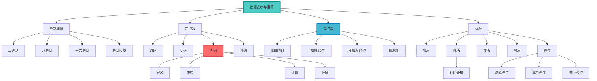

---

## 🖥️ CPU结构详细图

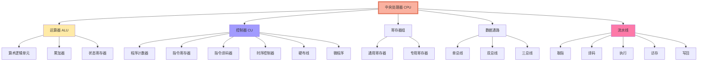

---

## ⚡ 流水线冒险处理图

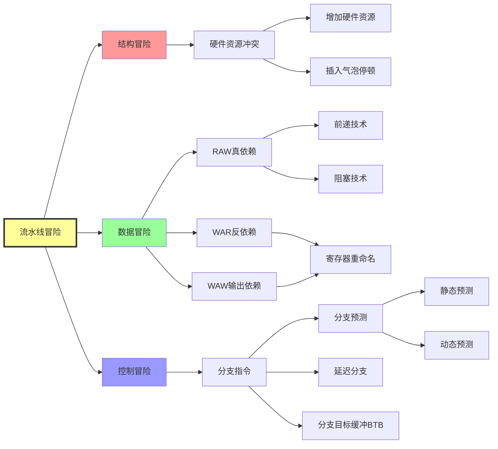

---

## 💾 存储层次结构图

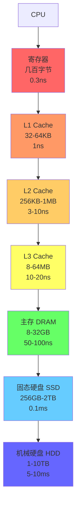

---

## 🗺️ Cache映射方式对比图

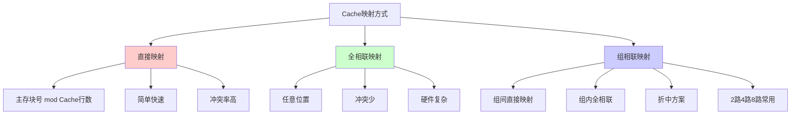

---

## 🔄 CISC vs RISC 对比图

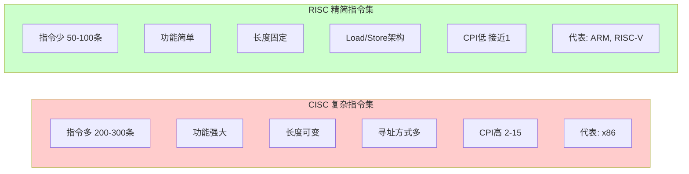

---

## 🚌 总线系统结构图

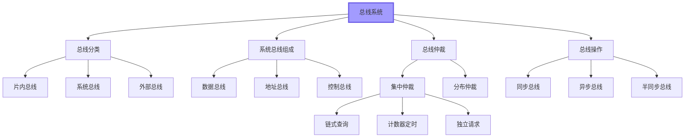

---

## 📥 I/O系统结构图

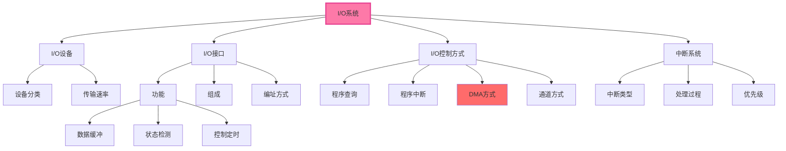

---

## 🔀 并行处理 Flynn 分类

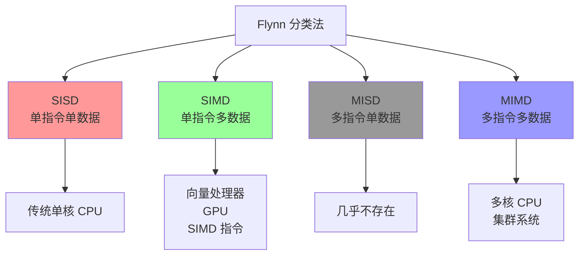

---

## 📈 性能优化策略图

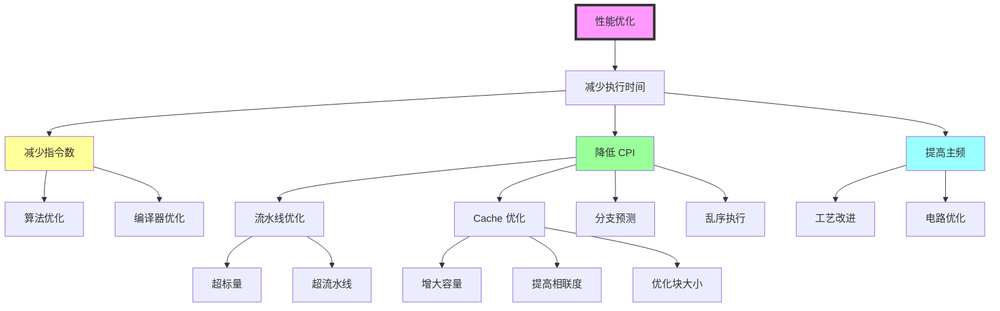

---

## 🗺️ 学习路径图


---

## 📐 核心公式速查

### CPU性能
```
CPU执行时间 = 指令数 × CPI × 时钟周期
MIPS = 主频 / (CPI × 10^6)
FLOPS = 浮点运算次数 / 执行时间
```

### 流水线
```
执行时间 = (k + n - 1) × Δt
吞吐率 = n / [(k + n - 1) × Δt]
加速比 = 不使用流水线时间 / 使用流水线时间
效率 = 实际使用时空区 / 总时空区
```

### Cache
```
命中率 = 命中次数 / 总访问次数
平均访问时间 = 命中率 × Cache时间 + (1-命中率) × 主存时间
AMAT = HitTime + MissRate × MissPenalty
```

### 并行处理
```
Amdahl定律: S = 1 / [(1-P) + P/N]
P - 可并行部分比例
N - 处理器数量
```

### 总线
```
总线带宽 = 总线频率 × 总线宽度 / 8
```

### 存储器
```
存储容量 = 存储单元数 × 字长
寻址空间 = 2^地址线数
```

---

## 🎯 重点知识点

### ⭐⭐⭐ 必考重点
- **补码表示与运算** - 定义、性质、计算、溢出判断
- **Cache技术** - 映射方式、替换算法、写策略
- **流水线技术** - 五级流水线、三种冒险及解决方法
- **指令执行过程** - 取指、译码、执行、访存、写回
- **性能计算** - CPU时间、MIPS、加速比、Amdahl定律

### ⭐⭐ 重要内容
- **浮点数表示** - IEEE754标准、规格化
- **虚拟存储** - 页式存储、页面置换算法
- **控制器设计** - 硬布线vs微程序
- **总线系统** - 总线仲裁、总线操作
- **中断系统** - 中断处理流程、优先级

### ⭐ 了解内容
- **现代处理器技术** - 乱序执行、分支预测、SMT
- **并行处理** - Flynn分类、多核架构
- **I/O控制方式** - DMA、通道方式

---

## 💡 Obsidian 使用提示

1. **启用 Mermaid 插件**：设置 → 社区插件 → 搜索 "Mermaid" 并启用
2. **查看图表**：点击图表区域可在预览模式下查看完整图表
3. **编辑模式**：在编辑模式下可修改 Mermaid 代码
4. **图表渲染**：如果图表不显示，尝试切换到预览模式

---

**最后更新：** 2025年1月  
**版本：** v2.0 Obsidian优化版
