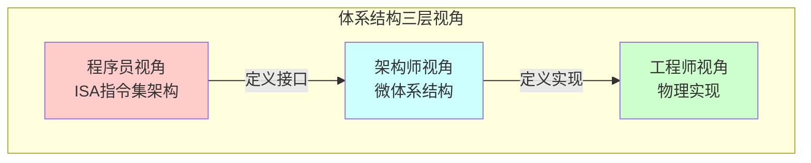
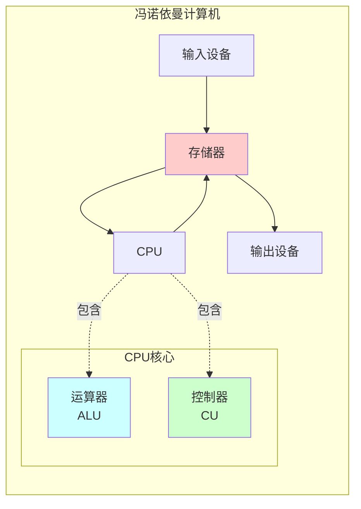
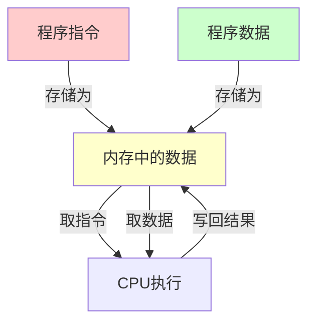
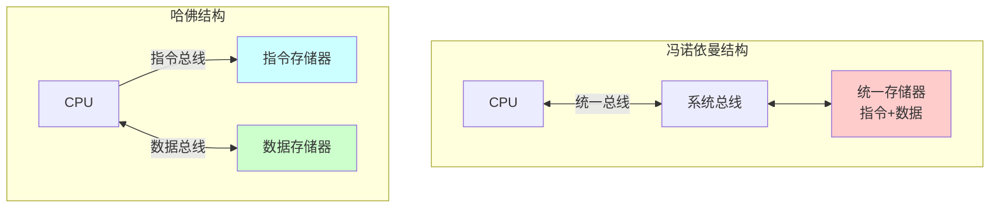
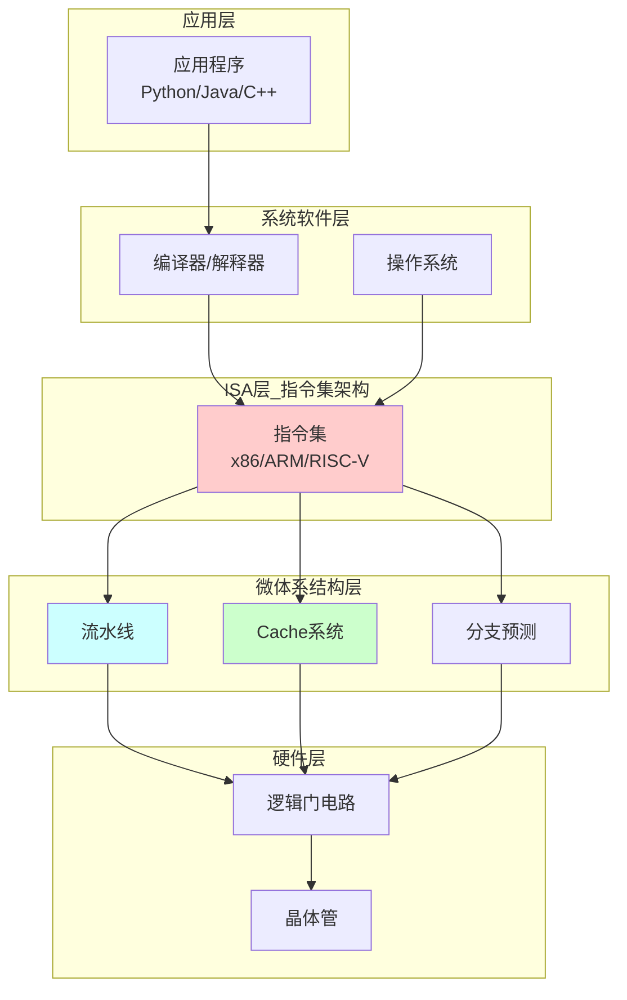

# 01-计算机体系结构概述：从零开始理解计算机

> **核心视角**：计算机是一个**状态机**，通过执行**函数**（指令）来改变**状态**（数据）。体系结构定义了这台状态机的**接口**和**组织方式**。  
> 最后更新：2025年1月

---

## 📑 目录

- [一、什么是计算机体系结构](#一什么是计算机体系结构)
- [二、冯诺依曼结构：现代计算机的基石](#二冯诺依曼结构现代计算机的基石)
- [三、计算机系统的层次结构](#三计算机系统的层次结构)
- [四、体系结构的三个维度](#四体系结构的三个维度)
- [五、总结](#五总结)

---

## 一、什么是计算机体系结构

### 1. 定义

**计算机体系结构 (Computer Architecture)** 是指程序员所看到的计算机属性，即**概念性结构**和**功能特性**。

### 2. 通俗理解：汽车与驾驶

为了更好地理解这三个层次，我们可以把计算机比作**一辆汽车**：

#### (1) 体系结构 = 驾驶操作手册 (用户接口)
这是**驾驶员（程序员）** 关心的部分。
*   **你看到什么**：方向盘、油门、刹车、仪表盘。
*   **你知道什么**：踩下油门车会加速，转动方向盘车会转向。
*   **你不关心什么**：发动机是几个气缸、燃油是如何喷射的。
*   **对应计算机**：指令集（ISA）。程序员只需要知道 `ADD` 指令能做加法，不需要知道电路是怎么实现加法的。

#### (2) 计算机组成 = 汽车内部构造 (逻辑实现)
这是**汽车设计师** 关心的部分。
*   **内部设计**：发动机是 V6 还是 V8？变速箱是自动挡还是双离合？
*   **性能影响**：V8 发动机比 V6 更快，但它们对驾驶员的操作要求是一样的（踩油门）。
*   **对应计算机**：微体系结构。Intel i9 和 i3 都能运行同样的 Windows 程序（体系结构相同），但 i9 内部流水线更宽、缓存更大（组成不同），所以跑得更快。

#### (3) 物理实现 = 制造工艺与材料 (物理硬件)
这是**制造工程师** 关心的部分。
*   **制造细节**：气缸是用铸铁还是铝合金？车身是用钢板还是碳纤维？
*   **对应计算机**：芯片制程。是用 14nm 工艺还是 5nm 工艺？这决定了芯片的功耗和发热。

> **一句话总结**：**体系结构**决定了你能不能用（兼容性），**组成**决定了你好不好用（性能），**实现**决定了能不能造出来（工艺）。

---

## 二、冯诺依曼结构：现代计算机的基石

### 1. 五大组成部分

| 组件 | 功能 | 状态/函数视角 |
|------|------|---------------|
| **运算器 (ALU)** | 执行算术和逻辑运算 | **函数**：改变状态的操作 |
| **控制器 (CU)** | 指挥各部件协调工作 | **调度器**：决定执行哪个函数 |
| **存储器 (Memory)** | 存储程序和数据 | **状态**：保存当前和历史状态 |
| **输入设备** | 接收外部信息 | **状态源**：外部状态输入 |
| **输出设备** | 输出处理结果 | **状态汇**：内部状态输出 |

### 1.5 通俗类比：厨房做菜模型

如果把**冯诺依曼计算机**比作一个**正在运作的厨房**，那么各个部件的角色如下：

*   **CPU (中央处理器) = 厨师**
    *   **运算器 (ALU)**：厨师手中的**菜刀和炒锅**。负责切菜（逻辑运算）和炒菜（算术运算）。
    *   **控制器 (CU)**：厨师的**大脑**。负责看食谱，决定下一步是切菜还是下锅，并指挥手（ALU）去操作。

*   **存储器 (Memory) = 厨房台面/置物架**
    *   **关键点**：在冯诺依曼结构中，**食谱 (程序指令)** 和 **食材 (数据)** 是放在同一个台面上的！
    *   厨师从台面上看一眼食谱（**取指**），然后从台面上拿一个土豆（**取数**），切好后放回盘子里（**写回**）。

*   **输入设备 = 采购员**
    *   源源不断地把新鲜食材（原始数据）买回来放到台面上。

*   **输出设备 = 传菜员**
    *   把做好的菜肴（处理结果）端出去给客人。

> **冯诺依曼瓶颈的通俗理解**：
> 想象一下，厨房台面（内存）很小，或者离厨师（CPU）很远。厨师切菜速度极快（CPU频率高），但他每切一刀，都要转身去台面上看一眼食谱，再转身拿一个土豆。
> **结果**：厨师大部分时间都花在转身和走路（数据传输）上，而不是在切菜。这就是**存储墙**或**冯诺依曼瓶颈**。

### 1.6 通俗类比：人体模型

如果把计算机比作**一个人**，各部件对应如下：

*   **CPU (中央处理器) = 大脑**
    *   **运算器**：负责算术（1+1=2）和逻辑判断（是/否）。
    *   **控制器**：负责指挥身体各部位（比如看到红灯停下，指挥脚踩刹车）。
*   **内存 (Memory) = 大脑的“短期记忆区”**
    *   你正在思考问题时，脑子里暂存的数据。速度快，但容量小，睡觉（断电）后容易忘记。
*   **硬盘 (Storage) = 笔记本/书包**
    *   你的知识库。容量大，记在纸上不会忘（非易失），但要用的时候得翻书（速度慢）。
*   **输入设备 = 眼睛、耳朵**
    *   接收外部信息（看书、听课）。
*   **输出设备 = 嘴巴、手**
    *   表达想法（说话、写字）。
*   **总线 (Bus) = 神经系统**
    *   传递大脑指令到手脚，传递眼睛看到的图像到大脑。

### 1.7 终极类比：办公桌模型 (最推荐)

如果让我推荐一个**最能解释计算机工作原理**的类比，那一定是**“办公桌模型”**。这个类比完美解释了**速度、容量和易失性**的关系。

想象你是一个**在办公室工作的职员**：

1.  **CPU = 你 (职员)**
    *   你是干活的核心。你的处理速度（大脑转得快不快）决定了工作效率。

2.  **内存 (RAM) = 你的办公桌**
    *   **特点**：就在手边，拿取文件**非常快**。
    *   **限制**：桌面**空间有限**。你不能把所有文件都堆在桌上，否则就没法干活了。
    *   **易失性**：下班回家（**断电**）前，你必须把桌上的文件收起来，否则清洁阿姨会把桌面清空（数据丢失）。

3.  **硬盘 (Storage) = 档案柜**
    *   **特点**：在墙角，空间**巨大**，可以放无数个文件夹。
    *   **限制**：离得远，走过去拿文件**很慢**。
    *   **非易失**：文件放在柜子里很安全，下班回家也不怕丢。

4.  **程序运行的过程**：
    *   **启动程序**：你走到档案柜（硬盘），把“操作手册”（程序）和“文件”（数据）拿出来，放到办公桌（内存）上。
    *   **运行**：你坐在桌前，看着手册，快速处理文件。
    *   **卡顿**：如果你打开了太多文件（程序），办公桌堆满了。你不得不把暂时不用的文件送回档案柜，再把要用的拿过来。这个频繁跑腿的过程（**页面置换/Swap**）会让你慢得像蜗牛。
    *   **保存**：你处理完文件，必须把它放回档案柜。如果你没放回去就断电了，刚才的工作就白干了。

### 2. 核心思想：存储程序

**存储程序 (Stored Program)** 是冯诺依曼结构的灵魂：

**革命性意义**：
- **之前**：程序是硬连线的（改程序 = 重新接线）
- **之后**：程序和数据都是内存中的**状态**，可以动态修改

**代价**：
- **冯诺依曼瓶颈**：CPU和内存之间只有一条总线，取指令和取数据会**竞争**（串行访问）

### 3. 冯诺依曼 VS 哈佛结构

| 特性 | 冯诺依曼 | 哈佛 |
|------|----------|------|
| **存储器** | 统一 | 分离 |
| **总线** | 共享 | 独立 |
| **优点** | 结构简单、灵活 | 并行访问、速度快 |
| **缺点** | 取指/访存冲突 | 结构复杂、成本高 |
| **应用** | 通用计算机 | DSP、嵌入式系统 |

**现代折中**：改进型哈佛结构
- 外部：统一内存（冯诺依曼）
- 内部：分离的指令Cache和数据Cache（哈佛）

---

## 三、计算机系统的层次结构

### 1. 抽象层次图

### 2. 三个关键层次 (详解与类比)

为了彻底理解这三个层次，我们继续使用**汽车**作为类比：

#### (1) ISA层 (指令集架构) —— “驾驶手册”
*   **定义**：这是程序员（驾驶员）能看到的接口。它规定了计算机能听懂哪些命令（指令）。
*   **类比**：**汽车的驾驶操作**。
    *   你只需要知道“踩油门车会走”、“转方向盘车会拐弯”。
    *   你不需要知道发动机里有几个气缸，也不用管它是怎么喷油的。
    *   **关键点**：只要学会了开这辆车（掌握了 x86 指令集），你就能开所有同类型的车（无论是 Intel 还是 AMD 的 CPU）。
*   **决定了什么**：**能不能用**（软件兼容性）。

#### (2) 微体系结构层 (Microarchitecture) —— “发动机设计”
*   **定义**：这是架构师（设计师）关心的内部实现。它决定了怎么把 ISA 规定的指令“跑”出来。
*   **类比**：**汽车的内部构造**。
    *   这辆车是用 V6 发动机还是 V8 发动机？是涡轮增压还是自然吸气？
    *   **关键点**：虽然驾驶操作（ISA）一样，但内部设计（微架构）不同，车的性能（速度、油耗）就不同。比如 i9 处理器比 i3 快，就是因为它的“发动机”设计得更精密、更强大。
*   **决定了什么**：**快不快**（性能）。

#### (3) 物理实现层 (Physical Implementation) —— “制造工艺”
*   **定义**：这是工程师（制造者）关心的物理硬件。它决定了芯片怎么被造出来。
*   **类比**：**汽车的制造材料与工艺**。
    *   气缸是用铸铁还是铝合金？车身是用钢板还是碳纤维？
    *   **关键点**：对应到芯片就是 **制程工艺**（如 5nm、7nm）。工艺越先进，晶体管越小，功耗越低，发热越少。
*   **决定了什么**：**烫不烫**（功耗与制造难度）。

---

## 四、体系结构的三个维度 (通俗类比)

这三个维度代表了计算机变快的**三种不同方式**。

### 1. 指令级并行 (ILP) —— “洗衣流水线”

*   **定义**：在单个 CPU 核心内，让多条指令“重叠”执行。
*   **类比**：**洗衣服**。
    *   洗衣服分三步：洗涤 -> 烘干 -> 折叠。
    *   **串行方式**：洗完一桶，烘干，折叠，然后再洗下一桶。
    *   **并行方式 (流水线)**：当第一桶衣服在烘干时，洗衣机空出来了，马上洗第二桶。
    *   **结果**：虽然洗一桶衣服的时间没变，但单位时间内洗完的衣服变多了。
*   **技术**：流水线 (Pipeline)、超标量 (Superscalar)。

### 2. 数据级并行 (DLP) —— “一刀切多根”

*   **定义**：用一条指令同时处理多个数据。
*   **类比**：**切胡萝卜**。
    *   **普通方式 (SISD)**：拿一根胡萝卜，切一刀；再拿一根，切一刀。
    *   **并行方式 (SIMD)**：把 4 根胡萝卜排成一排，一刀下去，4 根都切断了。
    *   **结果**：动作（指令）只做了一次，但处理了 4 个东西（数据）。
*   **技术**：SIMD 指令 (如 AVX-512)、GPU (显卡最擅长这个)。

### 3. 线程级并行 (TLP) —— “多位厨师”

*   **定义**：多个独立的程序（或线程）同时运行。
*   **类比**：**厨房里的多位厨师**。
    *   **单核**：只有一个厨师。他一会儿切菜，一会儿炒菜，一会儿煮汤（时间片轮转），看起来像在同时做，其实同一时刻只能干一件事。
    *   **多核 (TLP)**：请了 4 个厨师。厨师 A 专门炒菜，厨师 B 专门煮汤。他们互不干扰，真正的同时干活。
*   **技术**：多核处理器 (Multi-core)、超线程 (Hyper-Threading)。

---

## 五、总结

### 核心要点

✅ **计算机体系结构**定义了程序员可见的接口（ISA），而**计算机组成**定义了如何实现这个接口（微体系结构）。

✅ **冯诺依曼结构**的核心是**存储程序**：程序和数据都是内存中的状态，可以被CPU读取和修改。

✅ **计算机系统是分层的**：
   - **ISA层**：定义"做什么"（指令集）
   - **微体系结构层**：定义"怎么做"（流水线、Cache）
   - **物理层**：定义"用什么做"（晶体管、门电路）

✅ **性能提升的三个方向**：
   - **指令级并行**：流水线、超标量
   - **数据级并行**：SIMD、GPU
   - **线程级并行**：多核、多处理器

---

## 核心考点与习题映射 (Exam Focus)
> **来源**：`102-内存系统练习题`, `104-期末综合练习题`

### 1. 体系结构基础
*   **冯·诺依曼架构 (102-Q2, 104-Q1)**：
    *   存储程序、二进制、顺序执行。
    *   指令和数据同等地位 (通过访问阶段区分)。
    *   **五大部件**：运算器、控制器、存储器、输入设备、输出设备。
*   **字长 (102-Q4)**：CPU 一次处理的位数 (如 32位)。

---

**下一篇**：[02-数据组织与表示](02-数据组织与表示.md) - 理解计算机如何表示和组织数据

**相关阅读**：[A1-计算机系统概述](A1-计算机系统概述.md) - 本主题的速记版

---

**最后更新：** 2025年1月
