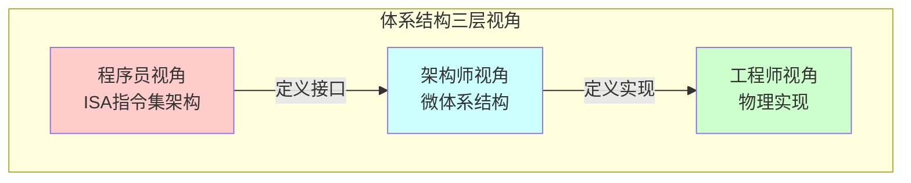
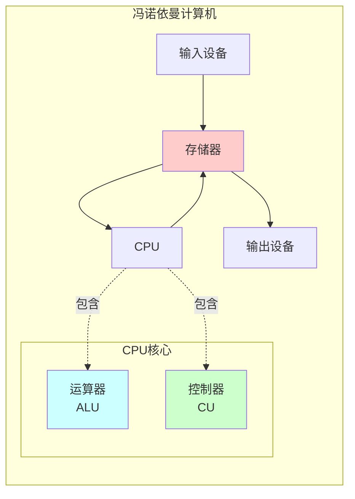
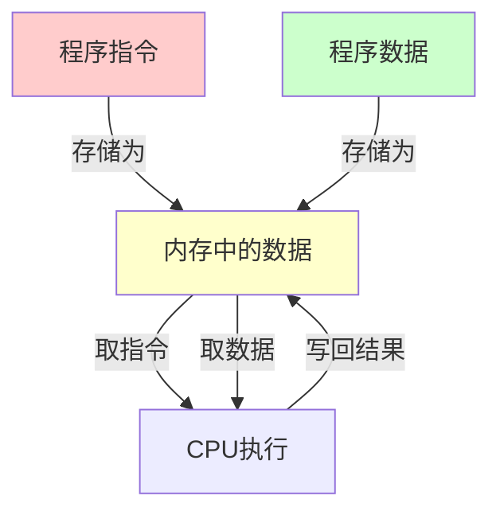
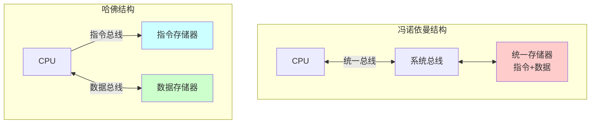
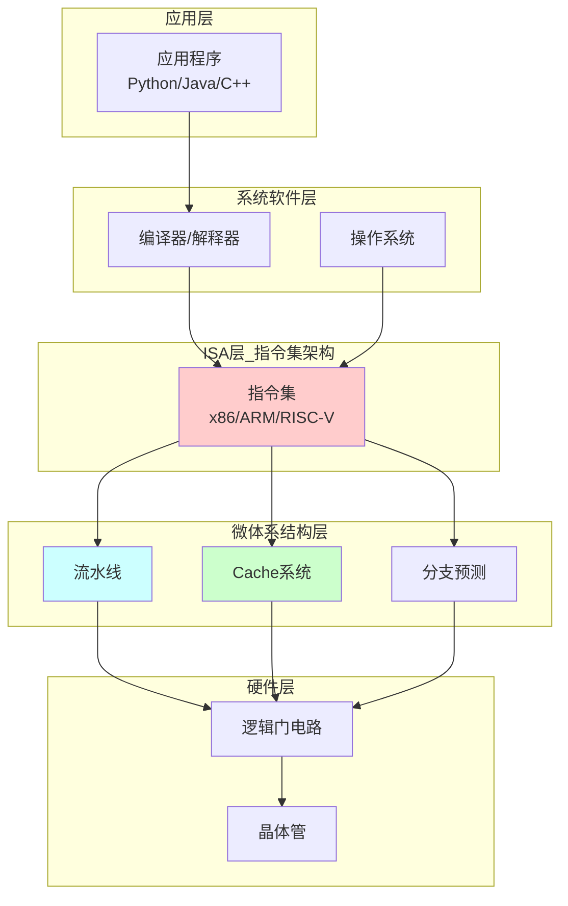
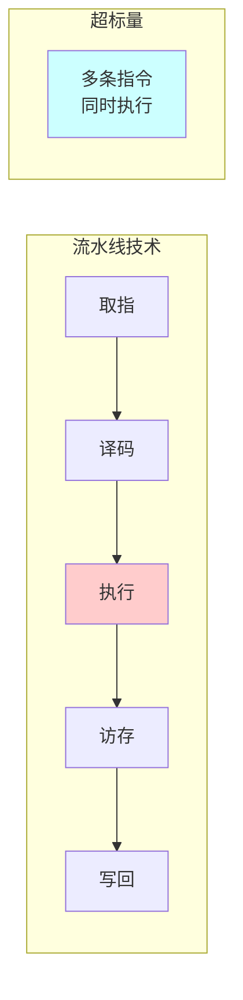
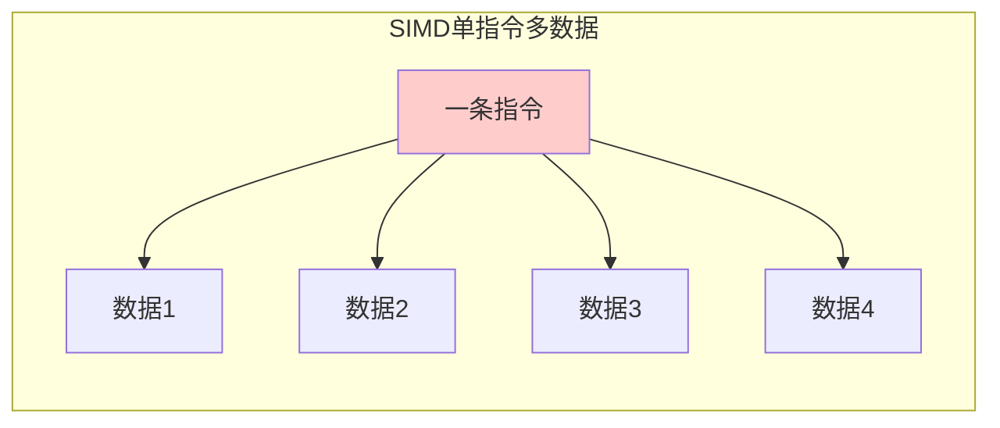
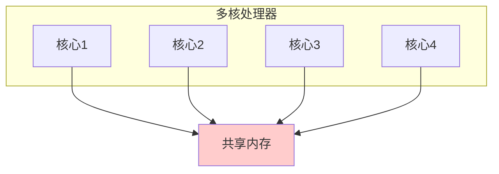
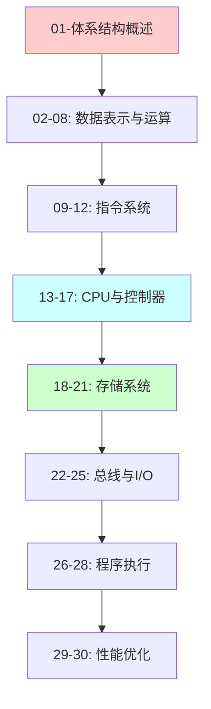

# 01-计算机体系结构概述：从零开始理解计算机

> **核心视角**：计算机是一个**状态机**，通过执行**函数**（指令）来改变**状态**（数据）。体系结构定义了这台状态机的**接口**和**组织方式**。  
> 最后更新：2025年1月

---

## 📑 目录

- [一、什么是计算机体系结构](#一什么是计算机体系结构)
- [二、冯诺依曼结构：现代计算机的基石](#二冯诺依曼结构现代计算机的基石)
- [三、计算机系统的层次结构](#三计算机系统的层次结构)
- [四、体系结构的三个维度](#四体系结构的三个维度)
- [五、总结](#五总结)

---

## 一、什么是计算机体系结构

### 1. 定义

**计算机体系结构 (Computer Architecture)** 是指程序员所看到的计算机属性，即**概念性结构**和**功能特性**。

### 2. 通俗理解：汽车与驾驶

为了更好地理解这三个层次，我们可以把计算机比作**一辆汽车**：

#### (1) 体系结构 = 驾驶操作手册 (用户接口)
这是**驾驶员（程序员）** 关心的部分。
*   **你看到什么**：方向盘、油门、刹车、仪表盘。
*   **你知道什么**：踩下油门车会加速，转动方向盘车会转向。
*   **你不关心什么**：发动机是几个气缸、燃油是如何喷射的。
*   **对应计算机**：指令集（ISA）。程序员只需要知道 `ADD` 指令能做加法，不需要知道电路是怎么实现加法的。

#### (2) 计算机组成 = 汽车内部构造 (逻辑实现)
这是**汽车设计师** 关心的部分。
*   **内部设计**：发动机是 V6 还是 V8？变速箱是自动挡还是双离合？
*   **性能影响**：V8 发动机比 V6 更快，但它们对驾驶员的操作要求是一样的（踩油门）。
*   **对应计算机**：微体系结构。Intel i9 和 i3 都能运行同样的 Windows 程序（体系结构相同），但 i9 内部流水线更宽、缓存更大（组成不同），所以跑得更快。

#### (3) 物理实现 = 制造工艺与材料 (物理硬件)
这是**制造工程师** 关心的部分。
*   **制造细节**：气缸是用铸铁还是铝合金？车身是用钢板还是碳纤维？
*   **对应计算机**：芯片制程。是用 14nm 工艺还是 5nm 工艺？这决定了芯片的功耗和发热。

> **一句话总结**：**体系结构**决定了你能不能用（兼容性），**组成**决定了你好不好用（性能），**实现**决定了能不能造出来（工艺）。

---

## 二、冯诺依曼结构：现代计算机的基石

### 1. 五大组成部分

| 组件 | 功能 | 状态/函数视角 |
|------|------|---------------|
| **运算器 (ALU)** | 执行算术和逻辑运算 | **函数**：改变状态的操作 |
| **控制器 (CU)** | 指挥各部件协调工作 | **调度器**：决定执行哪个函数 |
| **存储器 (Memory)** | 存储程序和数据 | **状态**：保存当前和历史状态 |
| **输入设备** | 接收外部信息 | **状态源**：外部状态输入 |
| **输出设备** | 输出处理结果 | **状态汇**：内部状态输出 |

### 1.5 通俗类比：厨房做菜模型

如果把**冯诺依曼计算机**比作一个**正在运作的厨房**，那么各个部件的角色如下：

*   **CPU (中央处理器) = 厨师**
    *   **运算器 (ALU)**：厨师手中的**菜刀和炒锅**。负责切菜（逻辑运算）和炒菜（算术运算）。
    *   **控制器 (CU)**：厨师的**大脑**。负责看食谱，决定下一步是切菜还是下锅，并指挥手（ALU）去操作。

*   **存储器 (Memory) = 厨房台面/置物架**
    *   **关键点**：在冯诺依曼结构中，**食谱 (程序指令)** 和 **食材 (数据)** 是放在同一个台面上的！
    *   厨师从台面上看一眼食谱（**取指**），然后从台面上拿一个土豆（**取数**），切好后放回盘子里（**写回**）。

*   **输入设备 = 采购员**
    *   源源不断地把新鲜食材（原始数据）买回来放到台面上。

*   **输出设备 = 传菜员**
    *   把做好的菜肴（处理结果）端出去给客人。

> **冯诺依曼瓶颈的通俗理解**：
> 想象一下，厨房台面（内存）很小，或者离厨师（CPU）很远。厨师切菜速度极快（CPU频率高），但他每切一刀，都要转身去台面上看一眼食谱，再转身拿一个土豆。
> **结果**：厨师大部分时间都花在转身和走路（数据传输）上，而不是在切菜。这就是**存储墙**或**冯诺依曼瓶颈**。

### 2. 核心思想：存储程序

**存储程序 (Stored Program)** 是冯诺依曼结构的灵魂：

**革命性意义**：
- **之前**：程序是硬连线的（改程序 = 重新接线）
- **之后**：程序和数据都是内存中的**状态**，可以动态修改

**代价**：
- **冯诺依曼瓶颈**：CPU和内存之间只有一条总线，取指令和取数据会**竞争**（串行访问）

### 3. 冯诺依曼 VS 哈佛结构

| 特性 | 冯诺依曼 | 哈佛 |
|------|----------|------|
| **存储器** | 统一 | 分离 |
| **总线** | 共享 | 独立 |
| **优点** | 结构简单、灵活 | 并行访问、速度快 |
| **缺点** | 取指/访存冲突 | 结构复杂、成本高 |
| **应用** | 通用计算机 | DSP、嵌入式系统 |

**现代折中**：改进型哈佛结构
- 外部：统一内存（冯诺依曼）
- 内部：分离的指令Cache和数据Cache（哈佛）

---

## 三、计算机系统的层次结构

### 1. 抽象层次图

### 2. 三个关键层次

#### (1) ISA层：程序员可见的接口

**ISA (Instruction Set Architecture)** 定义了：
- 指令格式和操作码
- 寄存器数量和用途
- 寻址方式
- 数据类型
- 异常处理机制

**类比**：ISA就像汽车的驾驶接口，规定了方向盘、油门、刹车的功能。

#### (2) 微体系结构层：如何实现ISA

**微体系结构 (Microarchitecture)** 定义了：
- 流水线级数和设计
- Cache层次和大小
- 分支预测策略
- 乱序执行机制

**类比**：微体系结构就像发动机的内部设计，决定了性能和效率。

**关键**：同一个ISA可以有多种微体系结构实现。例如：
- Intel Core i9 和 Intel Celeron 都支持 x86-64 ISA
- 但 i9 有更深的流水线、更大的Cache、更复杂的预测器

#### (3) 物理实现层：门电路和晶体管

**物理实现**定义了：
- 制程工艺（7nm、5nm）
- 功耗和散热
- 时钟频率上限

---

## 四、体系结构的三个维度

### 1. 指令级并行 (ILP)

**目标**：在单个CPU核心内并行执行多条指令
**技术**：流水线、超标量、乱序执行、分支预测

### 2. 数据级并行 (DLP)

**目标**：用一条指令同时处理多个数据
**技术**：SIMD指令（SSE、AVX）、GPU

### 3. 线程级并行 (TLP)

**目标**：多个线程/进程并行执行
**技术**：多核CPU、超线程、多处理器系统

---

## 五、总结

### 核心要点

✅ **计算机体系结构**定义了程序员可见的接口（ISA），而**计算机组成**定义了如何实现这个接口（微体系结构）。

✅ **冯诺依曼结构**的核心是**存储程序**：程序和数据都是内存中的状态，可以被CPU读取和修改。

✅ **计算机系统是分层的**：
   - **ISA层**：定义"做什么"（指令集）
   - **微体系结构层**：定义"怎么做"（流水线、Cache）
   - **物理层**：定义"用什么做"（晶体管、门电路）

✅ **性能提升的三个方向**：
   - **指令级并行**：流水线、超标量
   - **数据级并行**：SIMD、GPU
   - **线程级并行**：多核、多处理器

### 学习路线图

---

**下一篇**：[02-数据组织与表示](02-数据组织与表示.md) - 理解计算机如何表示和组织数据

**相关阅读**：[A1-计算机系统概述](A1-计算机系统概述.md) - 本主题的速记版

---

**最后更新：** 2025年1月
