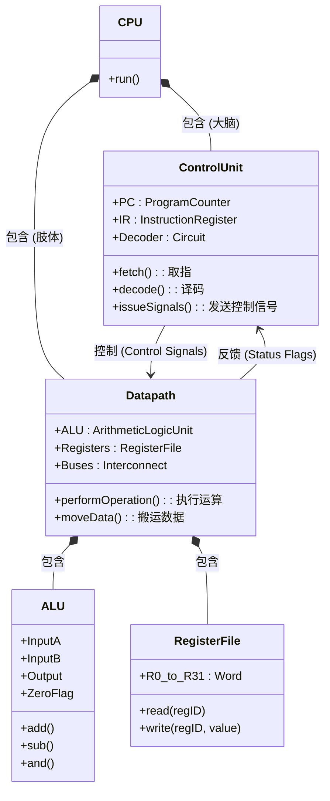

# 13-CPU结构：函数的执行引擎

> **核心视角**：CPU 是一个**函数执行引擎**。它的内部结构是为了高效地实现**取指（获取函数）**、**译码（解析函数）**和**执行（运行函数）**这一循环过程而设计的。
> 最后更新：2025年1月

---

## 一、CPU 的实体关系图 (ER/Class Diagram)

为了更清晰地展示 CPU 内部各组件的**所属关系**与**功能定义**，我们使用类图来描述。

### 1. 控制器 (Control Unit) —— 大脑
*   **属性**：拥有 `PC` (时间指针) 和 `IR` (当前指令)。
*   **方法**：负责 `fetch` (取) 和 `decode` (译)。
*   **关系**：它向数据通路发送**控制信号** (如 "ALU做加法", "寄存器写使能")。

### 2. 数据通路 (Datapath) —— 肢体
*   **属性**：拥有 `ALU` (计算能力) 和 `Registers` (短期记忆)。
*   **方法**：负责 `performOperation` (算) 和 `moveData` (搬)。
*   **关系**：它向控制器反馈**状态标志** (如 "结果为零 Z=1")，供控制器决定是否跳转。

---

## 二、关键寄存器：状态的锚点

寄存器是 CPU 内部极其昂贵但极快的小型存储单元，它们保存了 CPU 运行时的**关键状态**。

### 1. 用户可见寄存器 (程序员能用的)
*   **通用寄存器 (GPRs)**：如 x86 的 `EAX`, `EBX` 或 ARM 的 `R0`-`R15`。
    *   **作用**：存放当前函数的**局部变量**和**临时参数**。
    *   **数据视角**：它们是 CPU 的"工作台"，数据必须搬到这里才能被 ALU 处理。
*   **程序状态字 (PSW/Flags)**：
    *   **作用**：存放上一次运算的**结果状态**（零标志 Z、负标志 N、溢出标志 V）。
    *   **函数视角**：它是控制流指令（如 `if` 跳转）的判断依据。

### 2. 控制寄存器 (CPU 自己用的)
*   **PC (Program Counter)**：
    *   **作用**：指向**下一条**要执行的指令地址。
    *   **本质**：它是**时间**的指针，推动程序一步步向前执行。
*   **IR (Instruction Register)**：
    *   **作用**：存放**当前**正在执行的指令。
    *   **本质**：它是控制器的输入，决定了当前周期 CPU 要做什么。
*   **MAR (Memory Address Register) & MDR (Memory Data Register)**：
    *   **作用**：CPU 与内存（外部世界）交互的**缓冲区**。
    *   **本质**：由于 CPU 和内存速度差异巨大，需要这两个寄存器作为握手的桥梁。

---

## 三、数据通路 (Datapath)：血液循环系统

数据通路描述了**数据**在 CPU 内部流动的路径。

### 1. 典型流动路径
*   **取指路径**：`PC` -> `MAR` -> `Memory` -> `MDR` -> `IR`
    *   *含义*：根据时间指针找到函数，搬运到指令寄存器。
*   **运算路径**：`Regs` -> `ALU` -> `Regs`
    *   *含义*：从工作台拿原料，加工，放回工作台。
*   **访存路径**：`Regs` -> `MDR` -> `Memory` (写入) 或 `Memory` -> `MDR` -> `Regs` (读取)
    *   *含义*：将工作台的数据归档到仓库，或从仓库取货。

---

## 四、总结

*   **CPU** 不是一个黑盒，它是由**数据通路**（肌肉）和**控制器**（大脑）组成的有机体。
*   **寄存器**定义了 CPU 的当前**状态**。
*   **数据通路**定义了状态变化的**可能路径**。
*   **控制器**决定了在特定时刻走**哪一条路径**。
