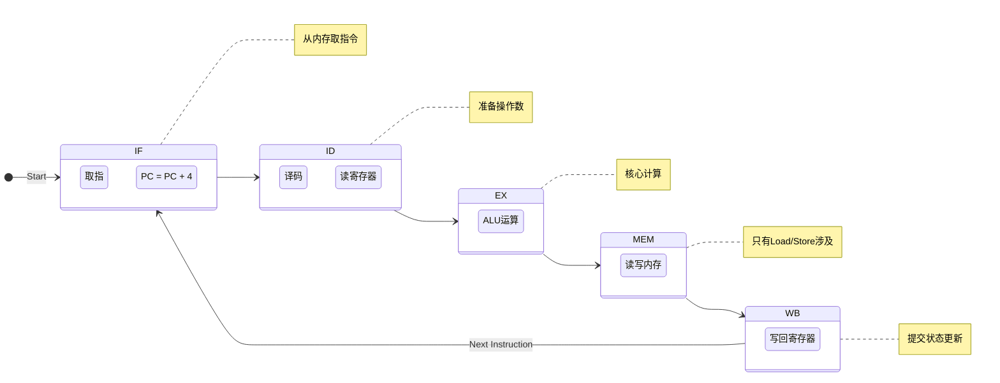

# 14-指令执行周期：函数的生命周期

> **核心视角**：指令周期描述了 CPU 如何处理一次**函数调用**的全过程。从"读取函数定义"到"理解函数意图"，再到"执行函数逻辑"和"返回结果"。
> 最后更新：2025年1月

---

## 一、生命周期的阶段划分

一条指令的生命周期通常包含以下阶段（以 MIPS 五级流水线为例）：

1.  **取指 (IF - Instruction Fetch)**：读取函数定义。
2.  **译码 (ID - Instruction Decode)**：解析参数和操作。
3.  **执行 (EX - Execute)**：核心运算。
4.  **访存 (MEM - Memory Access)**：读写外部状态（可选）。
5.  **写回 (WB - Write Back)**：更新内部状态。

---

## 二、各阶段详解

### 1. 取指 (IF)：获取函数
*   **任务**：根据 PC（程序计数器）从内存中取出指令，放入 IR（指令寄存器）。
*   **状态更新**：`PC = PC + 4`。
*   **本质**：CPU 问内存："接下来我该做什么？"

### 2. 译码 (ID)：解析函数
*   **任务**：
    *   **拆解指令**：看操作码（Opcode）知道是 `ADD` 还是 `LOAD`。
    *   **读取参数**：根据寄存器号（Rs, Rt），从寄存器堆中读出两个操作数的值（A, B）。
    *   **扩展立即数**：如果指令中包含立即数（如 `ADD R1, R2, #100`），将其扩展为 32 位。
*   **本质**：准备原材料。

### 3. 执行 (EX)：核心转换
*   **任务**：ALU 开始工作。
    *   如果是**运算指令**（`ADD`）：计算 `A + B`。
    *   如果是**访存指令**（`LOAD`）：计算内存地址 `Base + Offset`。
    *   如果是**分支指令**（`BEQ`）：计算跳转目标地址，并比较 `A` 和 `B` 是否相等。
*   **本质**：调用 ALU 这个纯函数进行计算。

### 4. 访存 (MEM)：外部交互
*   **任务**：只有 `LOAD` 和 `STORE` 指令会用到这个阶段。
    *   `LOAD`：从内存读数据。
    *   `STORE`：把数据写入内存。
*   **本质**：与巨大的外部状态仓库（Memory）进行同步。

### 5. 写回 (WB)：状态提交
*   **任务**：将 ALU 的计算结果或从内存读出的数据，写回到**目的寄存器**（Rd 或 Rt）。
*   **本质**：**提交事务**。只有这一步完成后，CPU 的内部状态（寄存器）才算真正更新了。

---

## 三、RTL：描述状态转换的语言

**寄存器传输语言 (RTL)** 是一种精确描述上述过程的伪代码。它关注的是**数据在寄存器之间的流动**。

*   **取指**：
    *   `MAR <- PC`
    *   `MDR <- Mem[MAR]`
    *   `IR <- MDR`
    *   `PC <- PC + 4`
*   **执行 (ADD R1, R2, R3)**：
    *   `A <- Reg[R2]`
    *   `B <- Reg[R3]`
    *   `Result <- A + B`
    *   `Reg[R1] <- Result`

---

## 四、总结

*   指令周期是一个严格的**时序过程**。
*   每个阶段都在利用 CPU 的不同部件（IF用PC/内存，ID用寄存器堆，EX用ALU）。
*   理解这个周期是理解**流水线技术**的前提——流水线就是让这些阶段重叠进行。
