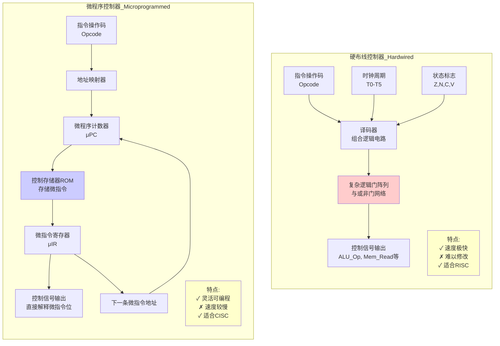
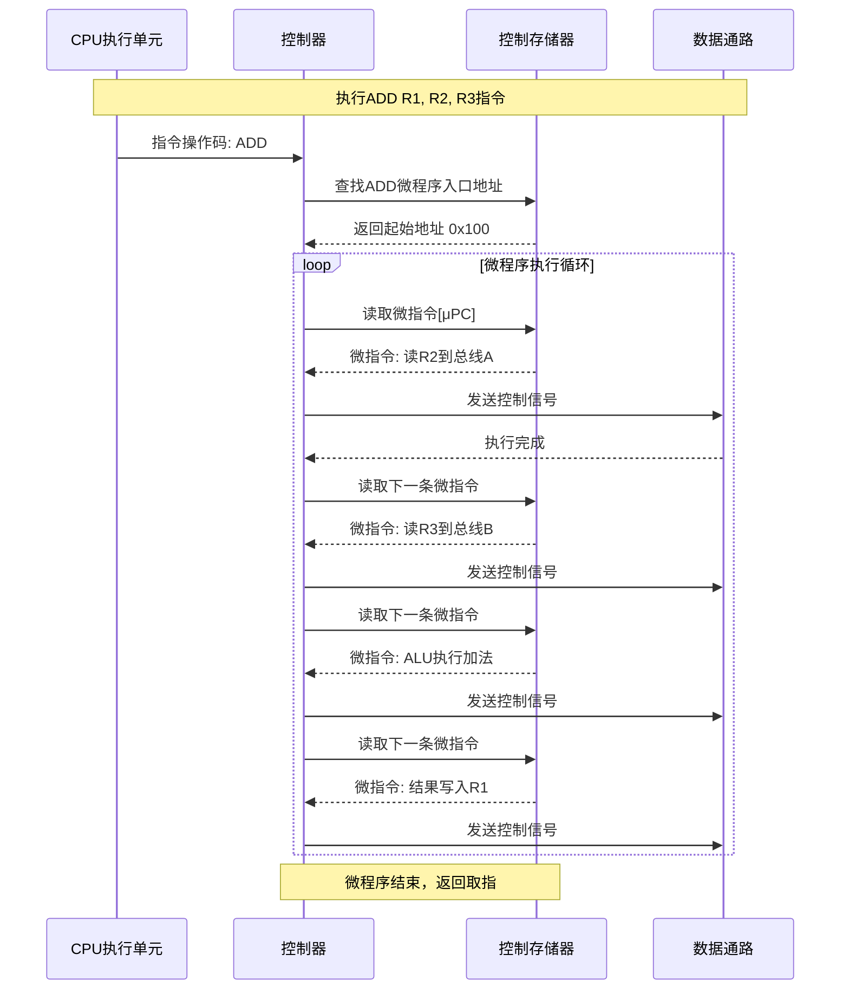

# 15-控制器设计：硬件逻辑 vs 固件代码

> **核心视角**：控制器是 CPU 的大脑，负责生成控制信号。设计控制器的核心矛盾在于：是用**复杂的电路**（硬布线）直接生成信号，还是用**存储的数据**（微程序）来查表生成信号？
> 最后更新：2025年1月

---

## 一、控制器的本质：有限状态机 (FSM)

无论怎么实现，控制器本质上都是一个**有限状态机**。
*   **输入**：当前指令（IR）、时钟信号、状态标志（Flags）。
*   **输出**：控制信号（如 `ALU_Op`, `Mem_Read`, `Reg_Write`）。
*   **状态**：取指、译码、执行、写回...

---

## 二、两种实现方式对比图

---

## 三、硬布线控制器 (Hardwired)：纯硬件的极致速度

### 1. 原理
将整个控制逻辑看作一个巨大的**组合逻辑函数**。
$$Output = F(Opcode, Step, Flags)$$

*   直接用**与门、或门、非门**搭建出这个逻辑电路。
*   当指令是 `ADD` 且处于 `T3` 周期时，电路直接输出 `ALU_ADD` 信号。

### 2. 特点
*   **速度**：**极快**。信号经过几级门电路延迟就出来了。
*   **灵活性**：**极差**。一旦芯片流片，逻辑就固化了。如果发现设计 bug 或想增加新指令，必须重新设计芯片。
*   **复杂度**：随着指令集变复杂，电路规模呈指数级增长。
*   **适用**：**RISC 架构**（指令简单规整，逻辑容易用电路实现）。

---

## 四、微程序控制器 (Microprogrammed)：用数据定义函数

### 1. 原理
将每条机器指令（如 `ADD`）看作一个**子程序**，这个子程序由更小的**微指令**组成。

*   **控制存储器 (Control Store)**：CPU 内部的一个小 ROM，存放了所有指令对应的微程序。
*   **微指令**：直接对应硬件的控制信号（如 "打开 ALU 输入阀门"）。
*   **执行过程**：
    1.  机器指令 `ADD` 到达。
    2.  控制器根据 `ADD` 的操作码，去 Control Store 查找 `ADD` 微程序的入口地址。
    3.  逐条读取微指令，直接输出为控制信号。

### 2. 特点
*   **灵活性**：**极好**。修改指令集只需要修改 ROM 中的微代码（固件），不需要改动硬件电路。
*   **速度**：**较慢**。每一步都需要查 ROM。
*   **适用**：**CISC 架构**（x86, IBM Mainframe）。
    *   CISC 指令极其复杂（如 `REP MOVSB` 字符串拷贝），硬布线几乎无法实现，但用微程序写个循环就很简单。

---

## 五、总结

| 特性 | 硬布线 (Hardwired) | 微程序 (Microprogrammed) | 数据/函数视角 |
| :--- | :--- | :--- | :--- |
| **实现载体** | 逻辑门电路 | ROM/RAM 存储器 | **电路** vs **数据** |
| **速度** | 快 | 慢 | 专用硬件 vs 查表解释 |
| **灵活性** | 差 | 好 | 固化函数 vs 可编程函数 |
| **代表架构** | MIPS, ARM, RISC-V | x86 (内部翻译为微操作) | RISC vs CISC |

现代高性能 CPU 往往采用**混合设计**：简单指令用硬布线（快），复杂指令用微程序（省面积）。
