# 16-流水线技术：函数的并行化

> **核心视角**：流水线 (Pipelining) 是一种**指令级并行 (ILP)** 技术。它利用了指令执行过程中的**阶段独立性**，让多条指令（函数）在时间上重叠执行，从而极大提高了系统的**吞吐率**。
> 最后更新：2025年1月

---

## 一、流水线的本质：时间重叠

想象一家洗车店，洗车分为 4 个步骤：冲洗、打泡沫、擦干、打蜡。每个步骤需要 10 分钟。

```mermaid
gantt
    title 5级流水线时空图
    dateFormat s
    axisFormat %s周期
    
    section 指令1-LOAD
    取指 :a1, 0, 1
    译码 :a2, 1, 1
    执行 :a3, 2, 1
    访存:a4, 3, 1
    写回 :a5, 4, 1
    
    section 指令2-ADD
    取指 :b1, 1, 1
    译码 :b2, 2, 1
    执行 :b3, 3, 1
    访存:b4, 4, 1
    写回 :b5, 5, 1
    
    section 指令3-SUB
    取指 :c1, 2, 1
    译码 :c2, 3, 1
    执行 :c3, 4, 1
    访存:c4, 5, 1
    写回 :c5, 6, 1
    
    section 指令4-STORE
    取指 :d1, 3, 1
    译码 :d2, 4, 1
    执行 :d3, 5, 1
    访存:d4, 6, 1
    写回 :d5, 7, 1
```

*   **串行模式**：洗完一辆车（40分钟）再洗下一辆。吞吐率 = 1.5 辆/小时。
*   **流水线模式**：
    *   第一辆车刚冲洗完进入打泡沫阶段，第二辆车马上开始冲洗。
    *   理想情况下，每 10 分钟就有一辆车洗完。吞吐率 = 6 辆/小时。
    *   **加速比**：4倍（等于流水线级数）。

在 CPU 中：
*   **IF** (取指) -> **ID** (译码) -> **EX** (执行) -> **MEM** (访存) -> **WB** (写回)
*   每个部件（ALU, 寄存器, 内存）在同一时刻都在为不同的指令服务。

---

## 二、流水线冒险 (Hazards)：并行的代价

当指令之间存在**依赖关系**时，流水线就会受阻。这被称为"冒险"。

### 1. 结构冒险 (Structural Hazard)：抢夺资源
*   **原因**：两条指令同时需要同一个硬件资源。
    *   例如：指令 A 在 IF 阶段读内存（取指令），指令 B 在 MEM 阶段读内存（取数据）。如果只有一个内存接口，就冲突了。
*   **解决**：**哈佛结构**（指令内存和数据内存分开）。

### 2. 数据冒险 (Data Hazard)：等待结果
*   **原因**：下一条指令依赖上一条指令的计算结果。
    *   `ADD R1, R2, R3`  (计算 R1)
    *   `SUB R4, R1, R5`  (使用 R1)
    *   `SUB` 在 ID 阶段需要读取 `R1`，但此时 `ADD` 还在 EX 阶段，`R1` 还没写回！
*   **解决**：
    *   **暂停 (Stall)**：让 `SUB` 等一等（插入气泡）。简单但降低性能。
    *   **旁路/前递 (Forwarding)**：将 `ADD` 在 ALU 计算出的结果，直接修一条"近路"传给下一条指令的 ALU 输入，而不需要等写回寄存器。

### 3. 控制冒险 (Control Hazard)：预测未来
*   **原因**：遇到跳转指令（如 `BEQ`），CPU 不知道下一条该取哪里的指令。
    *   必须等 `BEQ` 在 EX 阶段算出结果，才能确定下一条指令的地址。但这中间已经取出了 2-3 条错误的指令。
*   **解决**：**分支预测 (Branch Prediction)**。
    *   **猜**：CPU 猜测"大概率不跳转"或"大概率跳转"，并提前执行。
    *   **猜对了**：赚了，流水线没断。
    *   **猜错了**：清空流水线（Flush），回滚状态，重新取指。

---

## 三、性能指标

*   **吞吐率 (Throughput)**：单位时间内完成的指令数。流水线主要提高的是吞吐率。
*   **延迟 (Latency)**：一条指令从开始到结束的时间。流水线**不会**减少单条指令的延迟（甚至因为流水线寄存器的开销，延迟会略微增加）。

---

## 四、总结

*   流水线将 CPU 从"手工作坊"变成了"现代工厂"。
*   **理想 CPI** (Cycles Per Instruction) 为 1。
*   **冒险**是阻碍 CPI 达到 1 的主要因素。
*   现代 CPU 的大量晶体管（分支预测器、乱序执行引擎、重命名寄存器）都是为了解决冒险，维持流水线的满负荷运转。
