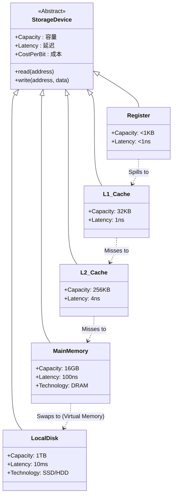

# 18-存储层次结构：速度与容量的博弈

> **核心视角**：存储层次结构是为了解决 CPU **函数执行速度**（极快）与**数据存储容量**（极大）之间的矛盾。它利用**局部性原理**，用金字塔式的结构欺骗 CPU，让它以为自己拥有一个**既快又大**的存储器。
> 最后更新：2025年1月

---

## 一、存储层次的类图 (Class Diagram)

存储层次结构本质上是一系列**存储接口**的实现，它们之间存在着**缓存 (Cache)** 与 **被缓存 (Backed By)** 的关系。

这个图展示了：
1.  **统一接口**：所有存储设备在逻辑上都提供 `read/write` 功能。
2.  **层级链条**：当上一层（如 L1）找不到数据（Miss）时，会自动请求下一层（L2）。
3.  **属性差异**：越往下，容量越大，延迟越高。

---

## 二、核心矛盾：快、大、廉的不可能三角

在物理定律的限制下，存储器无法同时满足以下三点：
1.  **速度快**（匹配 CPU 主频）。
2.  **容量大**（存下海量数据）。
3.  **价格廉**（用户买得起）。

*   **SRAM (Static RAM)**：
    *   **原理**：用 6 个晶体管（触发器）锁住一个状态位。
    *   **特点**：**极快**（无需刷新），但**面积大、贵**。
    *   **位置**：Cache。
*   **DRAM (Dynamic RAM)**：
    *   **原理**：用 1 个电容存电荷。
    *   **特点**：**密、便宜**，但**慢**（需要刷新，电容充放电慢）。
    *   **位置**：主存。

---

## 三、局部性原理 (Locality)：存储层次的基石

如果程序访问数据是完全随机的，那么存储层次结构将毫无意义。好在，程序的行为是可以预测的。

### 1. 时间局部性 (Temporal Locality)
*   **现象**：如果一个数据项被访问了，那么它在不久的将来很可能**再次被访问**。
*   **例子**：循环变量 `i`，频繁调用的函数代码。
*   **对策**：将最近访问的数据保留在**高速缓存 (Cache)** 中。

### 2. 空间局部性 (Spatial Locality)
*   **现象**：如果一个数据项被访问了，那么与它**地址相邻**的数据项很可能很快被访问。
*   **例子**：数组遍历，顺序执行的指令流。
*   **对策**：从慢速存储器取数据时，不只取一个字，而是取一个**块 (Block/Line)**。

---

## 四、总结

*   存储层次结构是一个**缓存系统**。
*   上一层是下一层的**缓存**。
*   **局部性原理**保证了热点数据大部分时间都待在金字塔的顶端，从而让 CPU 享受到接近 SRAM 的速度和接近 DRAM 的容量。
