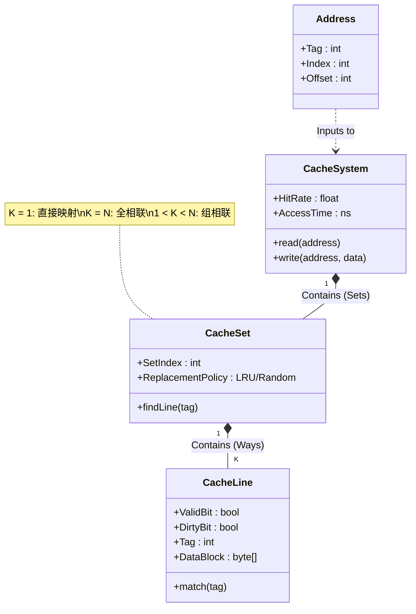

# 19-Cache技术：极速缓存的艺术

> **核心视角**：Cache 是一个**哈希表 (Hash Table)**。
> 它将巨大的主存地址空间映射到极小的 SRAM 空间中。所有的设计（直接映射、组相联）本质上都是在权衡**哈希冲突**与**查找速度**。
> 最后更新：2025年1月

---

## 一、Cache 的逻辑结构图 (Class Diagram)

Cache 不是一个简单的数组，它是一个精心设计的**多维结构**。

### 结构拆解
1.  **CacheSystem**：整体控制器。
2.  **CacheSet (组)**：哈希桶。通过地址的 `Index` 字段定位到具体的组。
3.  **CacheLine (行/块)**：最小存储单元。
    *   **Valid**：这行数据是有效的吗？
    *   **Dirty**：这行数据被修改过吗？（写回策略用）
    *   **Tag**：这行数据属于主存的哪个位置？（身份ID）
    *   **Data**：实际的数据内容（通常 64 字节）。

---

## 二、映射方式：哈希策略的选择

如何根据内存地址找到 Cache 中的位置？这取决于 `Index` 和 `Tag` 的划分。

### 1. 直接映射 (Direct Mapped) —— K=1
*   **规则**：每个内存块只能放在**唯一**的一个 Cache 行中。`Cache行号 = 内存块号 % Cache行数`。
*   **优点**：查找极快（不用比较，直接定位）。
*   **缺点**：**冲突严重**。如果程序交替访问映射到同一行的两个地址（如 `A` 和 `A + CacheSize`），会发生**抖动 (Thrashing)**。

### 2. 全相联 (Fully Associative) —— K=N
*   **规则**：内存块可以放在 Cache 的**任意**位置。
*   **优点**：冲突最少（只有 Cache 满了才会冲突）。
*   **缺点**：**查找极慢**。必须并发比较所有行的 Tag（电路复杂，功耗大）。

### 3. 组相联 (Set Associative) —— 1 < K < N (折中方案)
*   **规则**：内存块可以放在特定**组**内的**任意**一行中。
    *   先通过 `Index` 找到组。
    *   再在组内的 K 行中查找 Tag。
*   **主流选择**：现代 CPU 通常使用 **4路** 或 **8路** 组相联。

---

## 三、写策略：一致性的维护

当 CPU 修改了 Cache 中的数据，主存什么时候更新？

1.  **写直达 (Write Through)**：
    *   **策略**：每次写 Cache，同时也写主存。
    *   **优点**：主存始终是最新的，一致性好。
    *   **缺点**：**慢**。写操作被主存速度拖累。
2.  **写回 (Write Back)**：
    *   **策略**：只修改 Cache，标记为 **Dirty**。只有当这行被**替换**出去时，才写回主存。
    *   **优点**：**快**。多次写合并为一次写。
    *   **缺点**：实现复杂，断电可能丢数据。

---

## 四、总结

*   Cache 是 CPU 性能的倍增器。
*   **组相联**结构在冲突和速度之间找到了完美的平衡点。
*   **写回**策略在速度和复杂性之间选择了速度。
