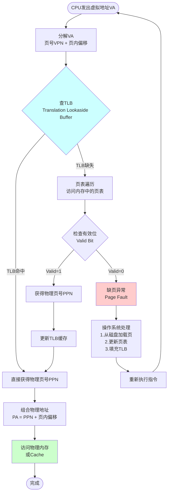
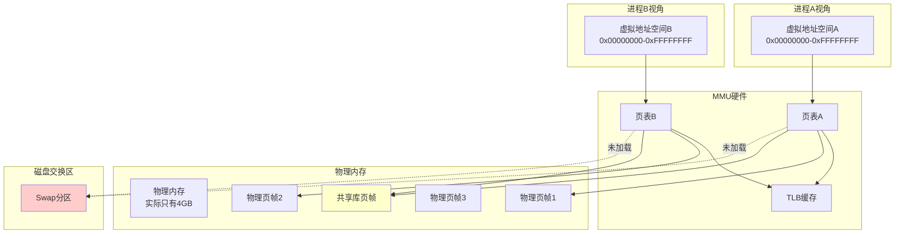

# 20-虚拟存储：私有的状态空间

> **核心视角**：虚拟存储 (Virtual Memory) 是操作系统和硬件合谋编织的**谎言**。它给每个进程提供了一个**独立的、连续的、巨大的**状态空间（虚拟地址空间），而底层通过**页表**将这些虚拟状态离散地映射到物理内存（甚至硬盘）上。
> 最后更新：2025年1月

---

## 一、核心机制：分页 (Paging)

为了灵活管理内存，我们将状态空间切分为固定大小的块，称为**页 (Page)**。

*   **虚拟页 (Virtual Page, VP)**：进程看到的逻辑块。
*   **物理页 (Physical Page / Page Frame, PF)**：内存条上的实际存储块。
*   **页表 (Page Table)**：一个巨大的**映射表**（函数），记录了 $VP \rightarrow PF$ 的对应关系。
    *   `Page_Table[VP_Number] = {PF_Number, Valid, Dirty, ...}`

---

## 二、地址翻译：硬件查表

CPU 发出的每一次访存指令，使用的都是**虚拟地址 (VA)**。MMU (Memory Management Unit) 必须在指令执行的流水线中，实时将其翻译为**物理地址 (PA)**。

### 地址翻译流程图

### 1. TLB (Translation Lookaside Buffer)
*   **本质**：页表的 **Cache**。
*   **作用**：页表存储在内存中，查页表本身就很慢。TLB 存储了最近用过的 $VP \rightarrow PF$ 映射。
*   **流程**：
    1.  CPU 发出 VA。
    2.  查 TLB。
    3.  **命中**：直接得到 PA，访问 Cache/内存。
    4.  **缺失**：MMU 遍历内存中的页表（Page Walk），填入 TLB，再重试。

### 2. 缺页异常 (Page Fault)
*   **场景**：当 CPU 访问一个**有效位 (Valid Bit) 为 0** 的页时。
*   **含义**：该虚拟页对应的数据不在物理内存中（可能在硬盘 Swap 区，或者还未分配）。
*   **处理**：
    1.  硬件触发异常，陷入操作系统内核。
    2.  操作系统启动磁盘 I/O，将缺失的页从硬盘读入物理内存。
    3.  更新页表，置 Valid = 1。
    4.  重新执行那条访存指令。

---

## 三、虚拟存储的架构图

---

## 四、虚拟存储的收益

1.  **隔离与保护**：每个进程都有自己的页表。进程 A 无论怎么写自己的虚拟地址，也无法修改进程 B 的物理内存，因为它的页表里根本没有指向进程 B 物理页的条目。
2.  **内存共享**：不同进程的虚拟页可以映射到同一个物理页（如共享库代码 `libc.so`）。
3.  **按需分配**：`malloc` 申请 1GB 内存时，OS 只是分配了虚拟页，并没有分配物理页。只有当程序真正**写**这些页时，才会触发缺页异常分配物理内存（Copy-on-Write）。

---

## 五、总结

*   **虚拟存储**将**逻辑状态**（程序视角）与**物理状态**（硬件视角）解耦。
*   **页表**是连接两者的桥梁。
*   **TLB** 是加速这座桥梁通行的关键设施。
*   通过这种机制，计算机系统实现了多任务的安全隔离和内存资源的高效利用。

---

## 核心考点与习题映射 (Exam Focus)
> **来源**：`102-内存系统练习题`

### 1. 虚拟内存 (Virtual Memory)
*   **目的 (102-Q12)**：扩大**逻辑**存储空间，解决主存容量不足的问题。
