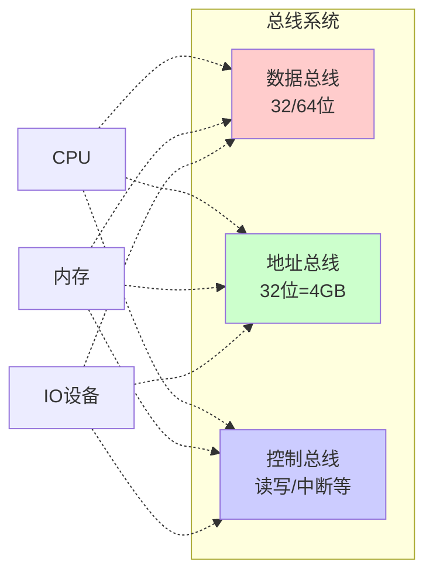
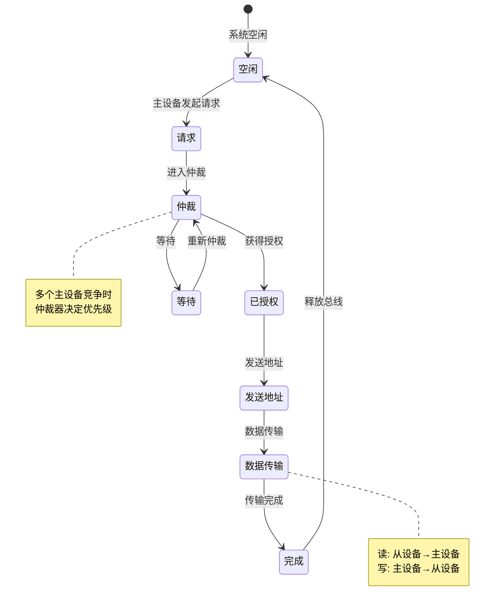

# 22-总线系统：数据的高速公路

> **核心视角**：总线 (Bus) 是计算机内部的**公共通信通道**。它解决了 N 个部件之间两两互联会导致线路爆炸（$O(N^2)$）的问题，将其简化为所有部件挂在一条公共线路上（$O(N)$）。
> 最后更新：2025年1月

---

## 一、总线系统的实体关系图 (ER Diagram)

总线系统是一个典型的**多对多关系**系统，其中多个主设备可以通过总线访问多个从设备。

```mermaid
erDiagram
    %% 实体定义
    主设备 {
        int 设备ID PK
        string 设备类型 "CPU, DMA, GPU"
        int 优先级
        bool 总线授权状态
    }
    
    从设备 {
        int 设备ID PK
        string 设备类型 "内存, IO, 外设"
        int 起始地址
        int 结束地址
        int 访问时间_纳秒
    }
    
    总线 {
        int 总线ID PK
        string 总线类型 "系统, 局部, 扩展"
        int 数据宽度_位 "32, 64"
        int 时钟频率_兆赫
        float 带宽_吉字节每秒
    }
    
    总线事务 {
        int 事务ID PK
        int 主设备ID FK
        int 从设备ID FKs
        int 总线ID FK
        string 操作类型 s"读, 写"
        int 地址
        int 数据大小_字节
        timestamp 开始时间
        timestamp 结束时间
    }
    
    总线仲裁器 {
        int 仲裁器ID PK
        string 仲裁策略 "优先级, 轮询, 先到先服务"
        int 当前主设备ID FK
    }
    
    总线请求 {
        int 请求ID PK
        int 主设备ID FK
        int 仲裁器ID FK
        timestamp 请求时间
        bool 已授权
        int 等待周期数
    }
    
    %% 关系定义
    主设备 ||--o{ 总线请求 : "提交"
    总线仲裁器 ||--|{ 总线请求 : "处理"
    总线仲裁器 ||--|| 总线 : "控制"
    
    主设备 ||--o{ 总线事务 : "发起"
    从设备 ||--o{ 总线事务 : "响应"
    总线 ||--|{ 总线事务 : "承载"
    
    主设备 }o--|| 总线 : "连接到"
    从设备 }o--|| 总线 : "连接到"
```

### 实体说明

1.  **主设备**：能够主动发起总线事务的设备（CPU、DMA 控制器、GPU）
2.  **从设备**：被动响应总线请求的设备（内存、I/O 接口、外设控制器）
3.  **总线**：物理传输介质，关键属性包括数据宽度、频率、带宽
4.  **总线事务**：一次完整的数据传输过程
5.  **总线仲裁器**：解决总线访问冲突的裁判
6.  **总线请求**：主设备申请总线使用权的记录

---

## 二、总线的本质：共享与分时

总线本质上是一组导线，具有以下特性：

*   **共享性**：所有部件都连接到这组导线上
*   **分时复用**：同一时刻，只能有一个主设备控制总线

### 三类信号线



1.  **数据总线 (Data Bus)**：传输**内容**（是什么）
2.  **地址总线 (Address Bus)**：传输**位置**（去哪里）
3.  **控制总线 (Control Bus)**：传输**命令**（干什么）

---

## 三、总线事务的状态机

一次总线事务的生命周期：



---

## 四、总线仲裁策略对比

| 策略 | 实现方式 | 优点 | 缺点 | 适用场景 |
|:-----|:---------|:-----|:-----|:---------|
| **链式查询** | 串行传递授权信号 | 简单、硬件少 | 优先级固定、不公平 | 简单系统 |
| **独立请求** | 每个设备独立请求线 | 响应快、灵活 | 硬件复杂 | 高性能系统 |
| **轮询** | 仲裁器轮询设备 | 公平 | 响应慢 | 实时性要求低 |
| **优先级** | 基于设备优先级 | 保证关键设备 | 可能饥饿 | 嵌入式系统 |

---

## 五、总结

*   总线是计算机的**骨架**，连接了五大部件
*   **带宽**（Bandwidth = Width × Frequency）是衡量总线性能的核心指标
*   **仲裁机制**解决了资源竞争问题
*   从单总线到多总线的演变，是为了隔离不同速度的设备，避免慢速设备拖累高速设备
