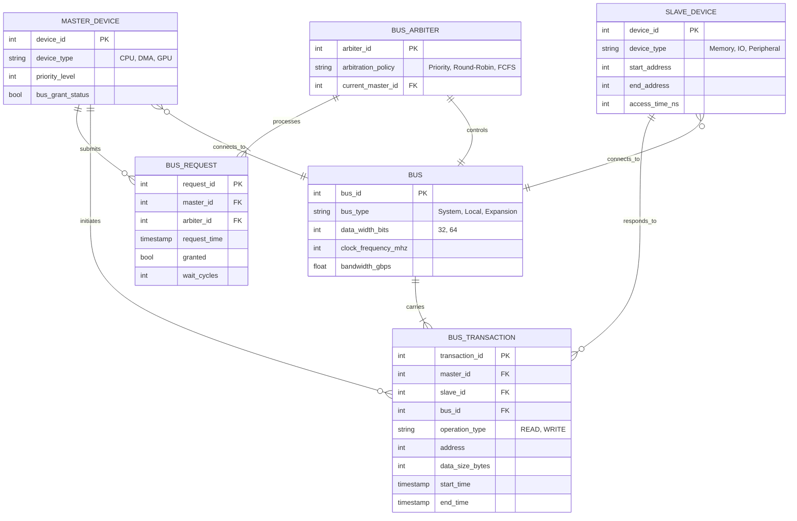
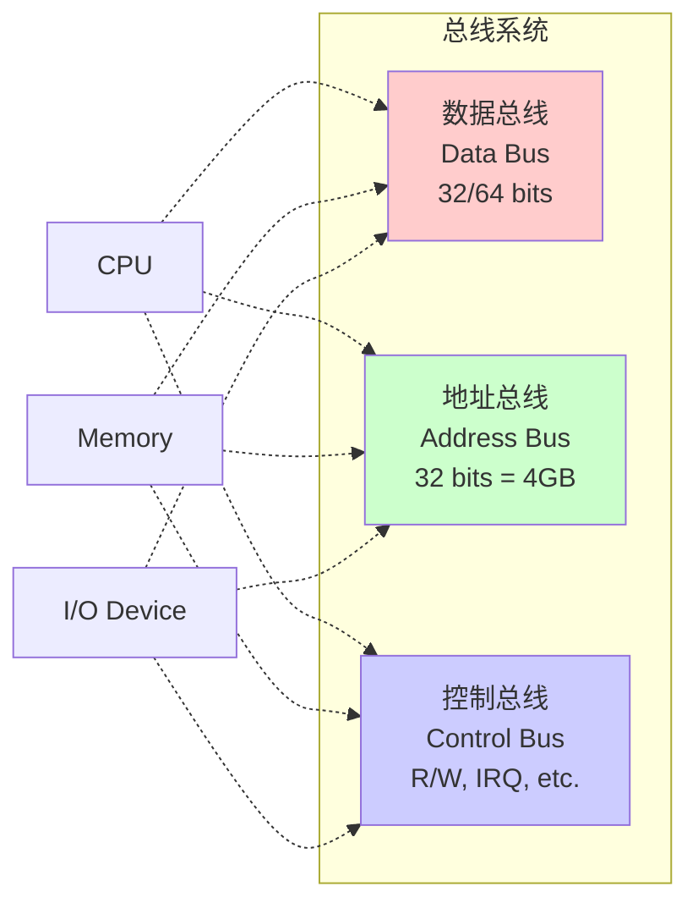
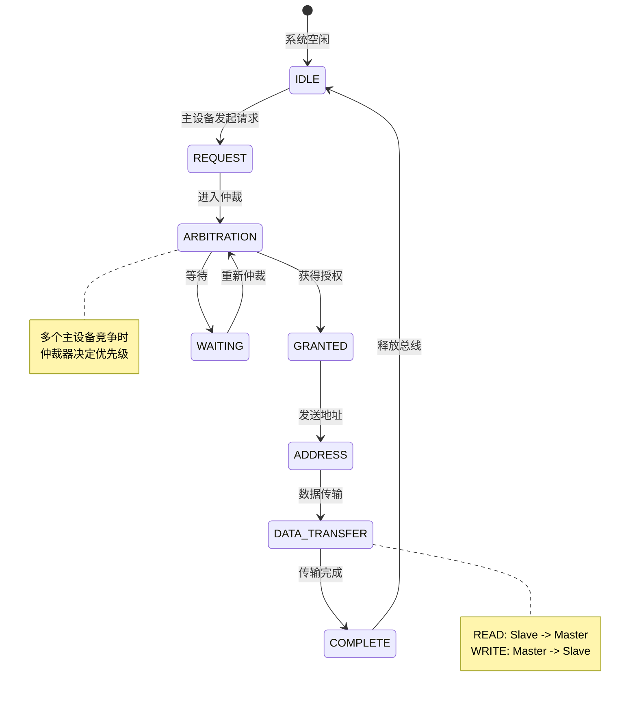

# 22-总线系统：数据的高速公路

> **核心视角**：总线 (Bus) 是计算机内部的**公共通信通道**。它解决了 N 个部件之间两两互联会导致线路爆炸（$O(N^2)$）的问题，将其简化为所有部件挂在一条公共线路上（$O(N)$）。
> 最后更新：2025年1月

---

## 一、总线系统的实体关系图 (ER Diagram)

总线系统是一个典型的**多对多关系**系统，其中多个主设备可以通过总线访问多个从设备。

### 实体说明

1.  **MASTER_DEVICE (主设备)**
    *   能够主动发起总线事务的设备
    *   具有优先级属性，用于仲裁
    *   示例：CPU、DMA 控制器、GPU

2.  **SLAVE_DEVICE (从设备)**
    *   被动响应总线请求的设备
    *   拥有地址范围，用于地址译码
    *   示例：内存、I/O 接口、外设控制器

3.  **BUS (总线)**
    *   物理传输介质
    *   关键属性：数据宽度、频率、带宽
    *   类型：系统总线、局部总线、扩展总线

4.  **BUS_TRANSACTION (总线事务)**
    *   一次完整的数据传输过程
    *   记录主设备、从设备、操作类型、地址、数据
    *   是主从设备交互的核心实体

5.  **BUS_ARBITER (总线仲裁器)**
    *   解决总线访问冲突
    *   实现不同的仲裁策略
    *   维护当前总线控制权归属

6.  **BUS_REQUEST (总线请求)**
    *   主设备申请总线使用权的记录
    *   包含等待时间、是否授权等状态信息

---

## 二、总线的本质：共享与分时

总线本质上是一组导线，具有以下特性：

*   **共享性**：所有部件都连接到这组导线上
*   **分时复用**：同一时刻，只能有一个主设备控制总线

### 三类信号线

1.  **数据总线 (Data Bus)**：传输**内容**（是什么）
2.  **地址总线 (Address Bus)**：传输**位置**（去哪里）
3.  **控制总线 (Control Bus)**：传输**命令**（干什么）

---

## 三、总线事务的状态机

一次总线事务的生命周期：

---

## 四、总线仲裁策略对比

| 策略 | 实现方式 | 优点 | 缺点 | 适用场景 |
|:-----|:---------|:-----|:-----|:---------|
| **链式查询** | 串行传递授权信号 | 简单、硬件少 | 优先级固定、不公平 | 简单系统 |
| **独立请求** | 每个设备独立请求线 | 响应快、灵活 | 硬件复杂 | 高性能系统 |
| **轮询** | 仲裁器轮询设备 | 公平 | 响应慢 | 实时性要求低 |
| **优先级** | 基于设备优先级 | 保证关键设备 | 可能饥饿 | 嵌入式系统 |

---

## 五、总结

*   总线是计算机的**骨架**，连接了五大部件
*   **带宽**（Bandwidth = Width × Frequency）是衡量总线性能的核心指标
*   **仲裁机制**解决了资源竞争问题
*   从单总线到多总线的演变，是为了隔离不同速度的设备，避免慢速设备拖累高速设备
