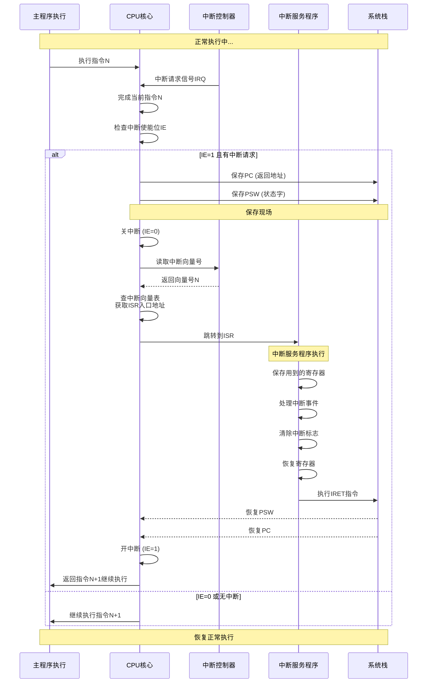
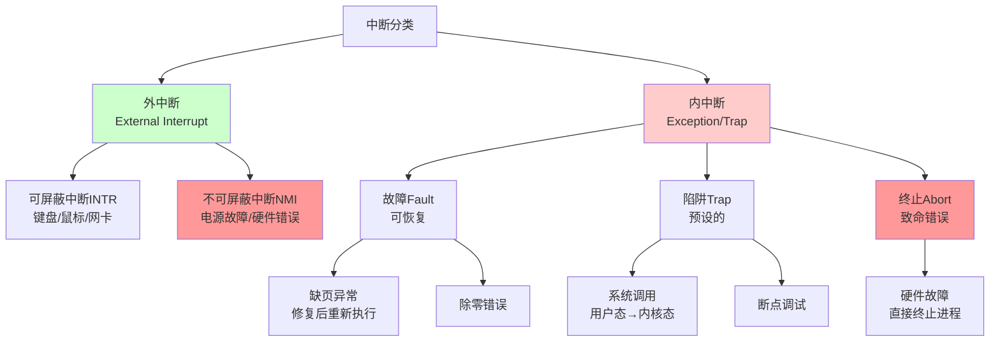
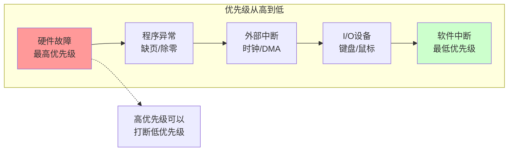

# 25-中断系统：事件驱动的内核

> **核心视角**：中断 (Interrupt) 是计算机系统的**神经脉冲**。它强制 CPU 暂停当前的**线性执行流**（函数），转而去处理一个突发的**异步事件**（中断服务程序），处理完后再恢复原状态。这是操作系统实现**多任务**和**实时响应**的基础。
> 最后更新：2025年1月

---

## 一、中断的本质：硬件触发的函数调用

普通函数调用 (`CALL`) 是**软件**预先安排好的。
中断 (`INT`) 是**硬件**随时可能触发的。

### 1. 流程对比

| 步骤 | 普通函数调用 | 中断处理 |
| :--- | :--- | :--- |
| **触发** | 执行 `CALL` 指令 | 外部信号 / 内部异常 |
| **保存断点** | 压栈 PC | 压栈 PC + **PSW (状态字)** |
| **寻址** | 指令中的地址 | **中断向量表** |
| **执行** | 子程序 | **中断服务程序 (ISR)** |
| **返回** | `RET` | `IRET` (恢复 PC + PSW) |

*   **关键点**：中断必须保存 **PSW (Program Status Word)**，因为中断可能发生在任何两条指令之间，不能改变被中断程序的标志位状态（如进位、零标志）。

---

## 二、中断处理完整流程图

---

## 三、中断分类：内忧与外患

### 中断分类树状图

### 1. 外中断 (Interrupt) —— 外部事件
由 CPU 外部设备触发，与当前指令无关。
*   **可屏蔽中断 (INTR)**：如键盘输入、打印机就绪。CPU 可以通过设置 `IF` 标志位来**忽略**（关中断）。
*   **不可屏蔽中断 (NMI)**：如电源掉电、内存校验错。天塌下来的大事，CPU **必须**立即响应。

### 2. 内中断 (Exception/Trap) —— 内部异常
由当前执行的指令触发。
*   **故障 (Fault)**：可修复的错误。如**缺页异常**。修复后重新执行该指令。
*   **陷阱 (Trap)**：预设的"坑"。如**系统调用 (System Call)**、断点调试。
*   **终止 (Abort)**：不可修复的致命错误。如硬件故障。直接杀进程。

---

## 四、中断判优：谁更重要？

当多个中断同时发生，或者在处理一个中断时又来了新中断，CPU 如何抉择？

### 中断优先级示意图

1.  **硬件排队器**：硬件电路决定优先级（如故障 > DMA > I/O）。
2.  **中断嵌套**：
    *   允许高优先级中断打断低优先级中断的处理。
    *   实现：在 ISR 中执行**开中断**指令。

---

## 五、总结

*   中断系统将 CPU 从**主动轮询**的低效模式中解放出来，转变为**被动响应**的高效模式。
*   它是**操作系统**的基石：
    *   **时钟中断**驱动了进程调度（分时多任务）。
    *   **I/O 中断**驱动了设备驱动程序。
    *   **系统调用**（软中断）是用户态进入内核态的唯一大门。

---

## 核心考点与习题映射 (Exam Focus)
> **来源**：`101-I-O系统练习题`

### 1. 中断系统进阶
*   **中断判优 (101-Q7)**：解决并发冲突。
*   **中断掩码 (101-Q14)**：
    *   **作用**：动态改变处理顺序 (非响应顺序)。
    *   **设置原则**：屏蔽自己 + 屏蔽低优先级。
*   **堆栈作用 (101-Q8)**：保存 PC 和 PSW (恢复现场)。
