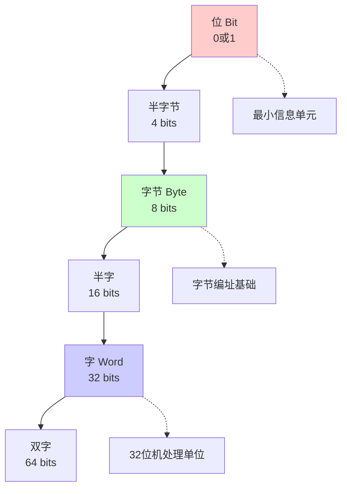
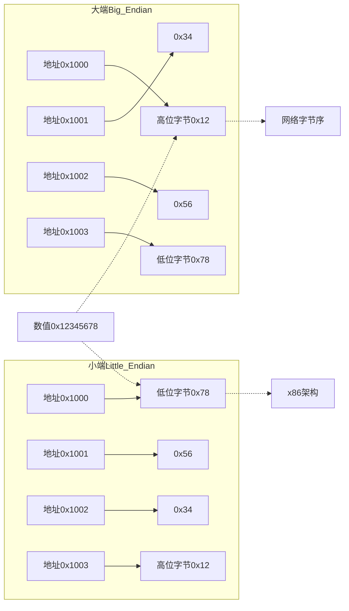
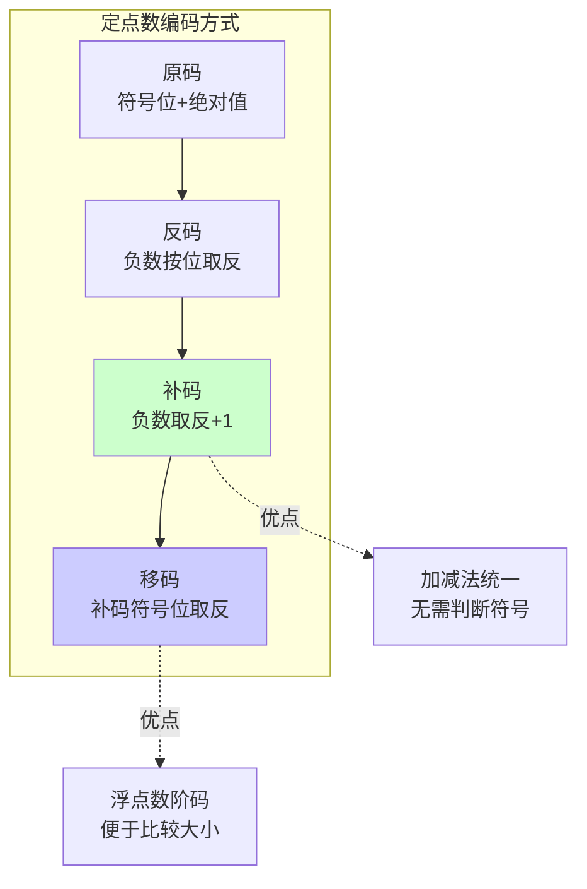

# A2 数据表示与运算

> 数据表示、编码与算术运算的核心知识  
> 涵盖原文：02-数据组织与表示、03-数制与编码、04-定点数表示、05-IEEE浮点数、06-二进制运算、07-移位与位运算、08-舍入与误差  
> 最后更新：2025年1月

---

## 📑 目录

- [一、数据单位与存储布局](#一数据单位与存储布局)
- [二、编码体系与进制转换](#二编码体系与进制转换)
- [三、定点数与浮点数表示](#三定点数与浮点数表示)
- [四、二进制运算核心算法](#四二进制运算核心算法)
- [五、移位运算与位操作](#五移位运算与位操作)
- [六、舍入策略与误差控制](#六舍入策略与误差控制)
- [七、速查表](#七速查表)

---

## 一、数据单位与存储布局

### 数据单位层次图



### 1. 基本单位
| 名称 | 含义 | 备注 |
|------|------|------|
| 位 bit | 最小信息单元 (0/1) | 数据传输、逻辑运算 |
| 字节 Byte | 8 bit | 字节编址基础 |
| 字 Word | 若干字节组成的处理单位 | 32位机常用4字节 |

### 2. 字节编址与端序



- **大端 (Big-Endian)**：高位字节存储在低地址；网络字节序标准
- **小端 (Little-Endian)**：低位字节存储在低地址；x86架构使用
- **一条原则**：计算地址时，用"地址 + 偏移"判断字节顺序

---

## 二、编码体系与进制转换

### 1. 常见编码
| 编码 | 含义 | 特点 |
|------|------|------|
| BCD | 十进制 -> 四位二进制 | 易转换，浪费空间 |
| ASCII | 7位字符编码 | 与扩展ASCII兼容 |
| Unicode/UTF-8 | 多字节编码 | 兼容ASCII，变长 |

### 2. 进制转换小技巧
- **十进制 -> 二进制**：除2取余，逆序排列
- **二进制 -> 十进制**：权值求和 (位权 = 2^n)
- **十进制 -> 十六进制**：先转二进制分组，再换16进制位
- **常考**：有符号数、补码的十进制表示

---

## 三、定点数与浮点数表示

### 定点数编码对比图



### 1. 定点数编码
| 编码 | 特点 | 范围 | 运算简便性 |
|------|------|------|------------|
| 原码 | 最高位符号，其余为绝对值 | `[-(2^{n-1}-1), 2^{n-1}-1]` | 加减需考虑符号 |
| 反码 | 正数同原码，负数按位取反 | 同原码 | 再减一步+1 |
| 补码 | 正数同原码，负数按位取反+1 | `[-2^{n-1}, 2^{n-1}-1]` | **加法统一** |
| 移码 | 补码最高位取反 | 浮点数阶码使用 |

> 口诀：**补码 = 原码取反 + 1**；**补码表示的负值 = 2^n - 补码值**

### IEEE 754 浮点数结构图

```mermaid
graph LR
    subgraph 单精度32位
        Sign1[符号位S<br/>1位] --- Exp1[阶码E<br/>8位] --- Frac1[尾数M<br/>23位]
    end
    
    Formula1[值 = (-1)^S × 1.M × 2^E-127]
    
    Sign1 -.-> Formula1
    
    Special[特殊值<br/>E=0: 非规格化<br/>E=255: ±∞/NaN]
    
    Exp1 -.-> Special
    
    style Sign1 fill:#ffcccc
    style Exp1 fill:#ccffcc
    style Frac1 fill:#ccccff
```

### 2. IEEE 754 浮点数
- **单精度**：1位符号 + 8位阶码 + 23位尾数 (隐含1)
- **值**：`(-1)^s × 1.f × 2^{E-127}`
- **特殊阶码**：`E=255` → ±∞ 或 NaN；`E=0` → 非规格化数
- **常见问题**：规格化、舍入、溢出、阶码偏移

---

## 四、二进制运算核心算法

### 1. 全加器、半加器
- **半加器**：输入(A,B)，输出和S、进位C
- **全加器**：输入(A,B,进位)，输出和S、进位C → 串联构成并行加法器

### 2. 补码加减法流程
```
补码运算：A + B
1) 若为减法：A + (-B) → B取补码
2) 按位相加，保留n位
3) 溢出判断：符号位进位 ≠ 次高位进位
```

### 3. 乘除法要点
- **乘法**：移位相加（串行乘法）、Booth算法处理负数
- **除法**：恢复余数 / 不恢复余数两种实现

---

## 五、移位运算与位操作

### 1. 移位类型
| 类型 | 规则 | 典型应用 |
|------|------|----------|
| 逻辑左移 (SHL) | 空位补0 | ×2^k |
| 算术右移 (SAR) | 符号位扩展 | /2^k (取整) |
| 循环左/右移 (ROL/ROR) | 末位移入首位 | 加密、CRC |

### 2. 位运算常用技巧
- 清零：`x & 0`； 置位：`x | (1 << k)`
- 取反：`~x`； 判断奇偶：`x & 1`
- 取第k位：`(x >> k) & 1`

---

## 六、舍入策略与误差控制

### 1. 四种舍入模式
| 模式 | 规则 | 示例(2.5) | 应用 |
|------|------|----------|------|
| **就近舍入** (Round to nearest even) | 最接近，等距取偶 | 2 | IEEE754默认 ⭐ |
| **向零舍入** (Round toward 0) | 截断小数 | 2 | 整数除法 |
| **向上舍入** (Round to +∞) | 永远向正无穷 | 3 | 上界计算 |
| **向下舍入** (Round to -∞) | 永远向负无穷 | 2 | 下界计算 |

> **关键**：就近舍入（等距时取偶）是IEEE754默认模式，避免累积误差

### 2. 误差类型与控制
- **截断误差**：真实值 - 表示值（如 1/3 = 0.333...）
- **精度损失**：大数+小数、相近数相减、连续运算
- **控制策略**：
  - 使用双精度（double）而非单精度（float）
  - 避免大数+小数（小数被忽略）
  - 避免相近数相减（有效数字减少）
  - 使用整数运算代替浮点运算

---

## 七、速查表

| 场景 | 要点速记 |
|------|----------|
| 补码转原码 | 符号位不变，其余位取反 +1 |
| 原码转补码 | 正数不变，负数取反 +1 |
| 浮点数偏置 | 单精度偏置127，双精度偏置1023 |
| 规格化判断 | 阶码 ≠ 0 且 ≠ 全1 |
| 移位求乘除 | `x << k` → `x × 2^k`；`x >> k` → `x ÷ 2^k`（算术右移） |

---

**温馨提示**：需要推导和示例时回看原主题 `02~08` 的详细笔记。
