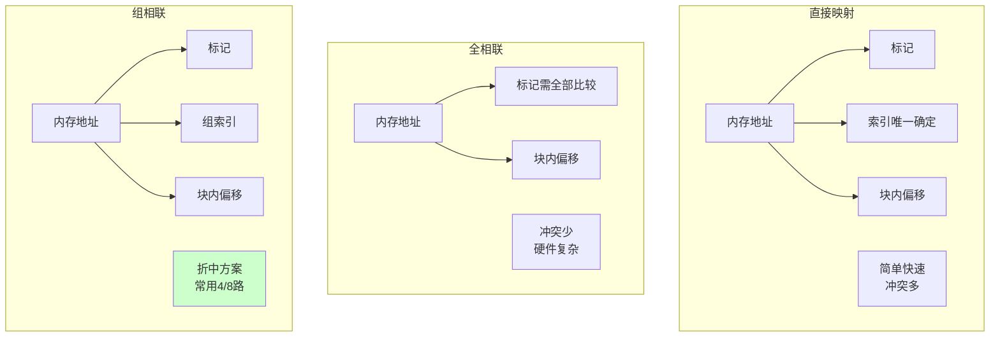
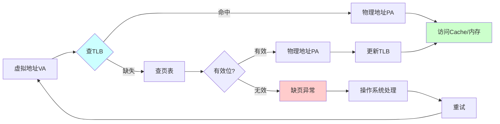

# A5 存储系统

> 存储层次、Cache、虚拟存储与辅存技术  
> 涵盖原文：18-存储层次结构、19-Cache技术、20-虚拟存储、21-辅助存储  
> 最后更新：2025年1月

---

## 📑 目录

- [一、存储层次与局部性](#一存储层次与局部性)
- [二、Cache 工作机制](#二cache-工作机制)
- [三、虚拟存储与页面管理](#三虚拟存储与页面管理)
- [四、辅助存储与磁盘调度](#四辅助存储与磁盘调度)
- [五、常考公式速记](#五常考公式速记)

---

## 一、存储层次与局部性

### 存储金字塔全景图

```mermaid
graph TB
    subgraph 存储层次金字塔
        Reg[寄存器<br/>< 1KB<br/>< 1ns<br/>$$$$$]
        L1[L1 Cache<br/>32-64KB<br/>1-2ns<br/>$$$$]
        L2[L2 Cache<br/>256KB-1MB<br/>3-10ns<br/>$$$]
        L3[L3 Cache<br/>8-64MB<br/>10-20ns<br/>$$]
        RAM[主存DRAM<br/>4-32GB<br/>50-100ns<br/>$]
        SSD[固态硬盘<br/>256GB-2TB<br/>100μs<br/>¢]
        HDD[机械硬盘<br/>1-10TB<br/>10ms<br/>¢]
    end
    
    Reg --> L1 --> L2 --> L3 --> RAM --> SSD --> HDD
    
    Speed[速度↓<br/>容量↑<br/>成本↓]
    
    Reg -.-> Speed
    
    style Reg fill:#ff9999
    style L1 fill:#ffcc99
    style L2 fill:#ffff99
    style L3 fill:#ccff99
    style RAM fill:#99ff99
    style SSD fill:#99ccff
    style HDD fill:#ccccff
```

### 1. 层次结构
```
CPU寄存器 → Cache → 主存 (DRAM) → 辅存 (磁盘/SSD)
      速度↑  ↖ 命中率↑     容量↓
```
- **时间局部性**：刚访问的地址很快可能再次访问
- **空间局部性**：访问地址附近的数据概率高
- **设计目标**：在保证高命中、低延迟的同时控制成本

### 2. 有效访问时间 (EAT)
`EAT = 命中时间 + 未命中率 × 未命中开销`
- 多级Cache：按层级递推
- 题目常给：命中率、访问时间，要求求EAT或命中率

---

## 二、Cache 工作机制

### Cache映射方式对比图



### 1. 映射方式
| 映射 | 地址拆分 | 特点 |
|------|----------|------|
| 直接映射 | Tag + Line + Word | 简单、冲突多 |
| 全相联 | Tag + Word | 冲突少、需并行比较 |
| 组相联 | Tag + Set + Word | 折中方案（常见：2/4/8路） |

### 2. 替换策略
- **随机**：硬件简单
- **FIFO**：先进先出
- **LRU**：最近最少使用（常考，需硬件/软件维护）
- **LFU**：最不常使用（较少考）

### 3. 写策略
| 策略 | 行为 | 优点 | 缺点 |
|------|------|------|------|
| 写直达 (write-through) | 同时写Cache与主存 | 数据一致性高 | 写延迟大 |
| 写回 (write-back) | 先写Cache，替换时写回 | 减少写主存次数 | 需脏位，数据一致性复杂 |

### 4. 多级Cache与一致性
**多级Cache结构**：
- L1：分数据Cache和指令Cache，每核独占（32-64KB）
- L2：每核独占（256KB-1MB）
- L3：多核共享（8-64MB）

**Cache一致性协议（多核关键）**：
- **MESI协议**：Modified/Exclusive/Shared/Invalid 四态
  - M态：数据被修改，只在一个Cache中
  - E态：数据独占，与主存一致
  - S态：数据共享，多个Cache中相同
  - I态：数据无效
  
- **一致性问题**：多核修改同一数据时需要同步
- **写失效**：一个核修改时，其他核的副本失效
- **写更新**：一个核修改时，其他核同步更新

---

## 三、虚拟存储与页面管理

### 虚拟地址转换流程



### 1. 页式存储关键概念
- **页 (Page)**：虚拟内存单位；**块/帧 (Frame)**：主存单位
- **页表**：虚实地址映射，可多级、带TLB
- **TLB命中率**：影响地址转换时间

### 2. 页面置换算法
| 算法 | 思路 | 特点 |
|------|------|------|
| FIFO | 最早进入的先淘汰 | 可能出现Belady异常 |
| LRU | 最近最久未使用 | 性能好，代价高 |
| OPT | 未来最长时间不访问 | 理论最优，只用于分析 |
| CLOCK | 近似LRU | 硬件实现简单 |

### 3. 缺页率与抖动
- 缺页率高 → CPU大量等待 → 产生**抖动**
- 解决：增加物理页帧、调整工作集、改善访问局部性

---

## 四、辅助存储与磁盘调度

### 1. 磁盘性能指标
- **寻道时间**：磁头移动到目标磁道
- **旋转延迟**：磁盘旋转等待目标扇区
- **传输时间**：数据传输出盘

### 2. 调度算法
| 算法 | 思路 | 优点 | 缺点 |
|------|------|------|------|
| FCFS | 按请求顺序 | 简单、公平 | 平均等待长 |
| SSTF | 最短寻道优先 | 减少平均寻道 | 可能饥饿 |
| SCAN (电梯) | 来回扫描 | 平衡 | 边缘等待长 |
| LOOK | 在最远请求处折返 | 减少无效扫描 | 需跟踪请求最远点 |

### 3. RAID 技术
- RAID0：条带化、性能高、无冗余
- RAID1：镜像、可靠性高、成本高
- RAID5：奇偶校验、性能/可靠性折中

---

## 五、常考公式速记

| 公式 | 含义 |
|------|------|
| `EAT = h × T_hit + (1 - h) × T_miss` | 有效访问时间 |
| `TLB EAT = h_tlb × T_tlb_hit + (1 - h_tlb) × (T_tlb_miss + 内存访问)` | 带TLB访问 |
| `磁盘访问时间 = 寻道 + 旋转延迟 + 传输时间` | 磁盘性能 |
| `缺页率 = 缺页次数 / 内存访问次数` | 判断抖动 |

---

查阅原主题 `18~21` 可获取详细图示、计算示例与扩展内容。
